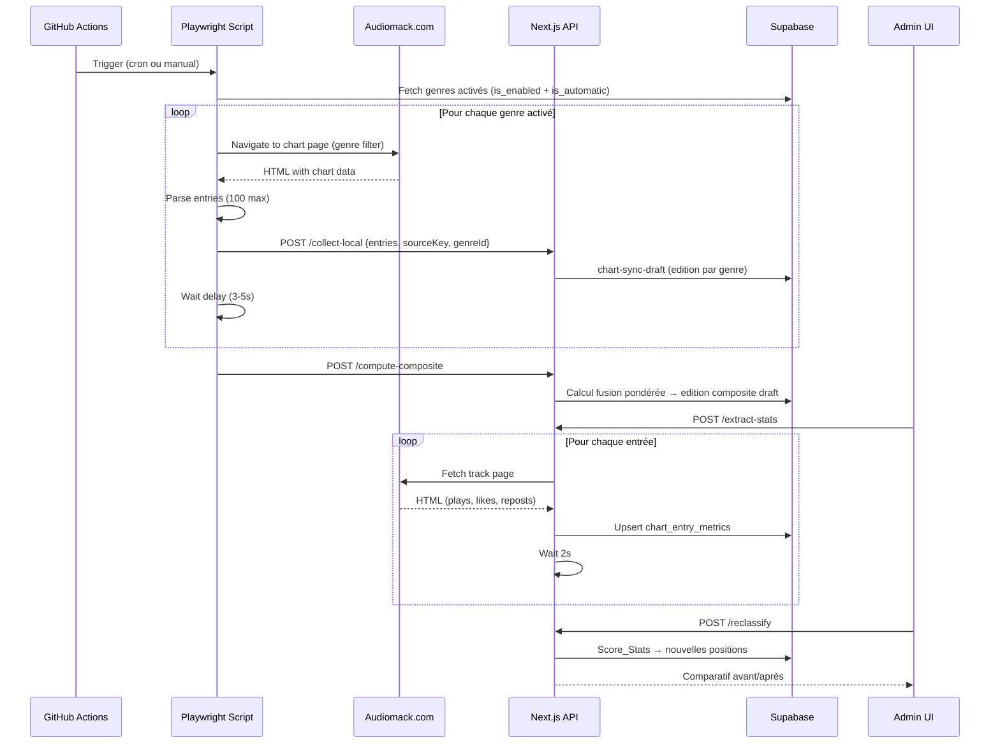
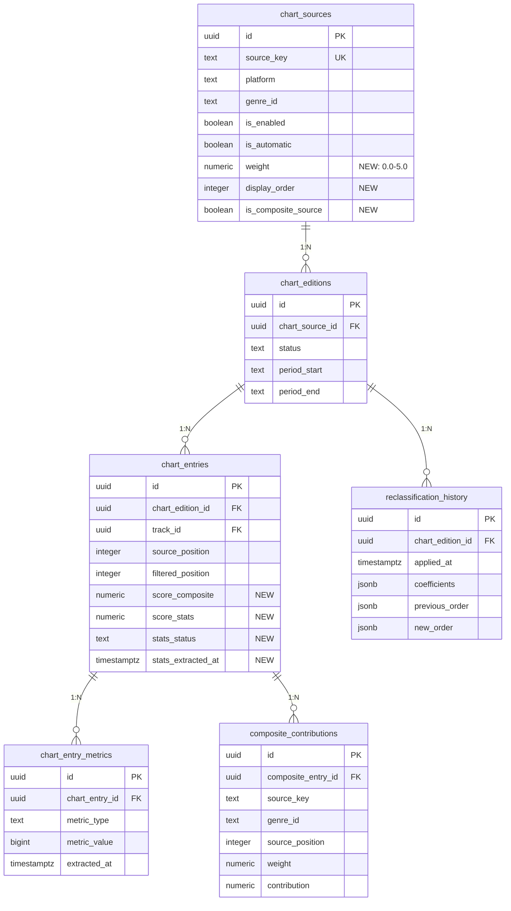

# Design Document: Audiomack Multi-Chart Ranking

## Overview

Ce module étend le système de classements Audiomack de Planète HMI pour transformer la collecte mono-genre (Weekly 100 Haiti) en un système multi-genres complet avec :

1. **Collecte multi-genres** : le script Playwright collecte séquentiellement N genres activés
2. **Classement composite** : un algorithme de fusion pondérée produit un « Best Of Audiomack Haiti » Top 20
3. **Extraction de statistiques** : scraping des pages individuelles Audiomack pour obtenir plays/likes/reposts
4. **Reclassement automatique** : recalcul des positions basé sur un Score_Stats configurable
5. **Prévisualisation audio** : embed Audiomack au survol/tap avec gestion du cycle de vie iframe
6. **Pages publiques multi-onglets** : navigation genre par genre + onglet composite
7. **Admin étendu** : panneau de configuration des genres, pondération, stats, reclassement

### Décisions architecturales clés

| Décision | Choix | Justification |
|----------|-------|---------------|
| Collecte séquentielle | Un genre à la fois avec délai | Éviter le rate-limiting Audiomack |
| Stockage métriques | Table `chart_entry_metrics` dédiée | Séparer métriques temporelles des entrées statiques |
| Composite comme source virtuelle | `source_key = audiomack_haiti_composite` | Réutilise le pipeline éditions/publication existant |
| Embed lazy-load | Iframe créé au hover/tap uniquement | Pas de chargement initial, performance maximale |
| SSR pour données publiques | ISR avec revalidation 1h | Aucun appel navigateur vers Audiomack |

---

## Architecture

### High-Level Architecture

```mermaid
graph TD
    subgraph "GitHub Actions (Lundi 06:00 UTC)"
        GHA[audiomack-collect.yml] --> PW[collect-playwright.mjs]
    end

    subgraph "Collection Layer"
        PW -->|genre=afrosounds| SC1[Scrape Chart Page]
        PW -->|genre=hip-hop-rap| SC2[Scrape Chart Page]
        PW -->|genre=caribbean| SC3[Scrape Chart Page]
        PW -->|genre=...| SCN[Scrape Chart Page]
    end

    subgraph "API Layer (Next.js)"
        SC1 --> API[/api/admin/charts/collect-local]
        SC2 --> API
        SC3 --> API
        SCN --> API
        API --> SYNC[chart-sync-draft.ts]
    end

    subgraph "Computation Layer"
        SYNC --> DB[(Supabase PostgreSQL)]
        COMP[composite-builder.ts] --> DB
        STATS[stats-extractor.ts] --> DB
        RECLASS[reclassification-engine.ts] --> DB
    end

    subgraph "Admin UI"
        ADM[AudiomackManager.tsx] --> COMP
        ADM --> STATS
        ADM --> RECLASS
        GENRE_CFG[GenreConfigPanel.tsx] --> DB
    end

    subgraph "Public Pages (SSR/ISR)"
        PUB[/charts/audiomack] --> DB
        PUB --> EMBED[AudiomackEmbed.tsx]
    end
```

### Low-Level Data Flow



---

## Components and Interfaces

### 1. Collection Module (Script Playwright)

**Fichier** : `app-next/scripts/collect-playwright.mjs`

```typescript
// Interface de configuration genre pour le script
interface GenreCollectionConfig {
  sourceKey: string;       // ex: "audiomack_haiti_top_songs_caribbean"
  genreId: string;         // ex: "caribbean"
  genreLabel: string;      // ex: "Caribbean"
  chartUrl: string;        // URL avec filtre genre
  isEnabled: boolean;
  isAutomatic: boolean;
}

// Paramètres d'entrée du script
interface CollectParams {
  genres: string[] | "all";   // Liste de genreId ou "all"
  source: "chart";            // Toujours chart pour multi-genres
  targetCount: number;        // 100
  delayBetweenGenres: number; // 3000-5000ms
}
```

**Modifications au script existant** :
- Ajout d'un appel initial à l'API pour récupérer les genres activés
- Boucle séquentielle sur chaque genre avec navigation vers `https://audiomack.com/top/songs?country=haiti&genre={genreId}`
- Envoi séparé par genre à `/api/admin/charts/collect-local` avec le `sourceKey` correspondant
- Appel final à `/api/admin/charts/compute-composite` après toutes les collectes

### 2. Composite Builder

**Fichier** : `app-next/src/lib/audiomack/composite-builder.ts`

```typescript
export interface CompositeContribution {
  sourceKey: string;
  genreId: string;
  genreLabel: string;
  sourcePosition: number;
  weight: number;
  contribution: number; // weight × (101 − position)
}

export interface CompositeEntry {
  trackId: string;
  platformTrackId: string | null;
  title: string;
  artistName: string;
  artworkUrl: string | null;
  sourceTrackUrl: string | null;
  artistSlug: string | null;
  trackSlug: string | null;
  compositeScore: number;
  genreCount: number;
  bestPosition: number;
  contributions: CompositeContribution[];
}

export interface CompositeConfig {
  weights: Map<string, number>;          // sourceKey → poids (0.0-5.0)
  minPublishedSources: number;           // Min 3 pour warning
  maxEntries: number;                    // 20
}

/**
 * Calcule le classement composite à partir des éditions publiées.
 * Formule : score = Σ (Poids_Genre × (101 − Position_Source))
 */
export async function buildComposite(
  supabase: SupabaseClient,
  config: CompositeConfig
): Promise<CompositeEntry[]>;

/**
 * Persiste le composite en tant qu'édition brouillon.
 */
export async function saveCompositeEdition(
  supabase: SupabaseClient,
  entries: CompositeEntry[],
  options: { periodStart: string; periodEnd: string }
): Promise<{ editionId: string }>;
```

### 3. Stats Extractor

**Fichier** : `app-next/src/lib/audiomack/stats-extractor.ts`

```typescript
export interface TrackStats {
  plays: number;
  likes: number;
  reposts: number;
  comments: number;
  extractedAt: string;
  success: boolean;
  error?: string;
}

export interface StatsExtractionProgress {
  total: number;
  completed: number;
  failed: number;
  currentTrack: string | null;
}

/**
 * Extrait les statistiques d'une page track Audiomack.
 * Parse le HTML pour récupérer les compteurs.
 */
export async function extractTrackStats(
  trackUrl: string
): Promise<TrackStats>;

/**
 * Extraction en lot avec progression et rate-limiting (2s entre requêtes).
 */
export async function extractEditionStats(
  supabase: SupabaseClient,
  editionId: string,
  onProgress?: (progress: StatsExtractionProgress) => void
): Promise<{ extracted: number; failed: number }>;
```

### 4. Reclassification Engine

**Fichier** : `app-next/src/lib/audiomack/reclassification-engine.ts`

```typescript
export interface ReclassificationCoefficients {
  plays: number;    // default 1.0
  likes: number;    // default 5.0
  reposts: number;  // default 3.0
}

export interface ReclassificationPreview {
  entries: Array<{
    entryId: string;
    trackTitle: string;
    artistName: string;
    originalPosition: number;
    newPosition: number;
    positionChange: number;   // positif = montée
    scoreStats: number;
    hasStats: boolean;
  }>;
  affectedCount: number;
  unchangedCount: number;
}

export interface ReclassificationHistoryEntry {
  id: string;
  editionId: string;
  appliedAt: string;
  coefficients: ReclassificationCoefficients;
  previousOrder: string[];  // entryIds dans l'ancien ordre
  newOrder: string[];       // entryIds dans le nouvel ordre
}

/**
 * Calcule Score_Stats = (plays × coeff_plays) + (likes × coeff_likes) + (reposts × coeff_reposts)
 */
export function computeScoreStats(
  stats: TrackStats,
  coefficients: ReclassificationCoefficients
): number;

/**
 * Prévisualise le reclassement sans l'appliquer.
 */
export async function previewReclassification(
  supabase: SupabaseClient,
  editionId: string,
  coefficients: ReclassificationCoefficients
): Promise<ReclassificationPreview>;

/**
 * Applique le reclassement et enregistre l'historique.
 */
export async function applyReclassification(
  supabase: SupabaseClient,
  editionId: string,
  coefficients: ReclassificationCoefficients
): Promise<{ historyId: string }>;
```

### 5. Embed Preview Component

**Fichier** : `app-next/src/components/charts/AudiomackEmbedPreview.tsx`

```typescript
interface AudiomackEmbedPreviewProps {
  artistSlug: string;
  trackSlug: string;
  trackTitle: string;
  artistName: string;
}

/**
 * Composant de prévisualisation audio.
 * - Desktop : popover au survol (300ms debounce)
 * - Mobile : bottom sheet au tap
 * - Une seule instance active à la fois (singleton)
 * - Iframe détruit à la fermeture
 */
export function AudiomackEmbedPreview(props: AudiomackEmbedPreviewProps): JSX.Element;
```

### 6. Genre Config Panel (Admin)

**Fichier** : `app-next/src/components/admin/GenreConfigPanel.tsx`

```typescript
interface GenreConfig {
  sourceKey: string;
  genreId: string;
  genreLabel: string;
  isEnabled: boolean;
  isAutomatic: boolean;
  weight: number;          // 0.0 - 5.0
  displayOrder: number;
  lastCollectedAt: string | null;
  currentEditionStatus: "draft" | "validated" | "published" | null;
  entryCount: number;
}

interface GenreConfigPanelProps {
  genres: GenreConfig[];
  onToggleEnabled: (sourceKey: string, enabled: boolean) => void;
  onWeightChange: (sourceKey: string, weight: number) => void;
  onOrderChange: (sourceKeys: string[]) => void;
}
```

### 7. API Routes

| Route | Méthode | Description |
|-------|---------|-------------|
| `/api/admin/charts/collect-local` | POST | Réception des entrées collectées (existant, étendu avec `sourceKey`) |
| `/api/admin/audiomack/compute-composite` | POST | Calcul du classement composite |
| `/api/admin/audiomack/genres` | GET/PATCH | Lecture/mise à jour config genres |
| `/api/admin/audiomack/extract-stats` | POST | Lancement extraction stats |
| `/api/admin/audiomack/extract-stats/progress` | GET | Progression extraction (SSE) |
| `/api/admin/audiomack/reclassify` | POST | Prévisualisation ou application reclassement |
| `/api/admin/audiomack/reclassify/history` | GET | Historique des reclassements |
| `/api/charts/audiomack` | GET | Données publiques (composite + genres) |
| `/api/admin/audiomack/genres/activated` | GET | Genres activés (pour le script Playwright) |

---

## Data Models

### Modifications à `chart_sources`

```sql
-- Nouvelles colonnes ajoutées à la table existante
ALTER TABLE chart_sources ADD COLUMN IF NOT EXISTS weight numeric(3,2) DEFAULT 1.0 
  CHECK (weight >= 0 AND weight <= 5.0);
ALTER TABLE chart_sources ADD COLUMN IF NOT EXISTS display_order integer DEFAULT 0;
ALTER TABLE chart_sources ADD COLUMN IF NOT EXISTS is_composite_source boolean DEFAULT false;
```

### Nouvelle table : `chart_entry_metrics`

```sql
CREATE TABLE chart_entry_metrics (
  id uuid PRIMARY KEY DEFAULT gen_random_uuid(),
  chart_entry_id uuid NOT NULL REFERENCES chart_entries(id) ON DELETE CASCADE,
  metric_type text NOT NULL,  -- 'plays', 'likes', 'reposts', 'comments'
  metric_value bigint NOT NULL DEFAULT 0,
  extracted_at timestamptz NOT NULL DEFAULT now(),
  
  UNIQUE(chart_entry_id, metric_type)
);

CREATE INDEX idx_entry_metrics_entry ON chart_entry_metrics(chart_entry_id);
CREATE INDEX idx_entry_metrics_type ON chart_entry_metrics(metric_type);
```

### Nouvelle table : `composite_contributions`

```sql
CREATE TABLE composite_contributions (
  id uuid PRIMARY KEY DEFAULT gen_random_uuid(),
  composite_entry_id uuid NOT NULL REFERENCES chart_entries(id) ON DELETE CASCADE,
  source_key text NOT NULL,
  genre_id text NOT NULL,
  source_position integer NOT NULL,
  weight numeric(3,2) NOT NULL,
  contribution numeric(10,2) NOT NULL,
  
  UNIQUE(composite_entry_id, source_key)
);

CREATE INDEX idx_composite_contrib_entry ON composite_contributions(composite_entry_id);
```

### Nouvelle table : `reclassification_history`

```sql
CREATE TABLE reclassification_history (
  id uuid PRIMARY KEY DEFAULT gen_random_uuid(),
  chart_edition_id uuid NOT NULL REFERENCES chart_editions(id) ON DELETE CASCADE,
  applied_at timestamptz NOT NULL DEFAULT now(),
  applied_by text,  -- admin identifier
  coefficients jsonb NOT NULL,  -- {"plays": 1.0, "likes": 5.0, "reposts": 3.0}
  previous_order jsonb NOT NULL, -- ["entry_id_1", "entry_id_2", ...]
  new_order jsonb NOT NULL,      -- ["entry_id_1", "entry_id_2", ...]
  
  CONSTRAINT valid_coefficients CHECK (
    coefficients ? 'plays' AND coefficients ? 'likes' AND coefficients ? 'reposts'
  )
);

CREATE INDEX idx_reclass_history_edition ON reclassification_history(chart_edition_id);
```

### Modifications à `chart_entries`

```sql
-- Colonne pour stocker le score composite ou stats
ALTER TABLE chart_entries ADD COLUMN IF NOT EXISTS score_composite numeric(12,2);
ALTER TABLE chart_entries ADD COLUMN IF NOT EXISTS score_stats numeric(14,2);
ALTER TABLE chart_entries ADD COLUMN IF NOT EXISTS stats_extracted_at timestamptz;
ALTER TABLE chart_entries ADD COLUMN IF NOT EXISTS stats_status text DEFAULT 'pending'
  CHECK (stats_status IN ('pending', 'extracted', 'failed', 'unavailable'));
```

### Modèle TypeScript complet

```typescript
// Types pour le composite
export interface CompositeSourceEntry {
  sourceKey: string;
  genreId: string;
  genreLabel: string;
  sourcePosition: number;
  weight: number;
  contribution: number;
}

// Extension du type d'entrée de classement
export interface ChartEntryWithMetrics {
  id: string;
  chartEditionId: string;
  trackId: string;
  sourcePosition: number;
  filteredPosition: number | null;
  scoreComposite: number | null;
  scoreStats: number | null;
  statsStatus: "pending" | "extracted" | "failed" | "unavailable";
  statsExtractedAt: string | null;
  metrics: {
    plays: number;
    likes: number;
    reposts: number;
    comments: number;
  } | null;
  contributions: CompositeSourceEntry[] | null;  // Uniquement pour composite
}

// Config genre admin
export interface GenreSourceConfig {
  id: string;
  sourceKey: string;
  genreId: string;
  displayName: string;
  isEnabled: boolean;
  isAutomatic: boolean;
  weight: number;
  displayOrder: number;
  isCompositeSource: boolean;
  lastSuccessAt: string | null;
  lastError: string | null;
}
```

### Diagramme ER des modifications



---


## Correctness Properties

*A property is a characteristic or behavior that should hold true across all valid executions of a system — essentially, a formal statement about what the system should do. Properties serve as the bridge between human-readable specifications and machine-verifiable correctness guarantees.*

### Property 1: Batch fault tolerance

*For any* ordered sequence of collection or extraction tasks where an arbitrary subset fails (throws or returns error), the system SHALL successfully complete all non-failing tasks and report individual failures without aborting the batch.

**Validates: Requirements 1.3, 12.6**

### Property 2: Genre filtering and edition isolation

*For any* set of Source_Genre entries with mixed `is_enabled` states, the collection process SHALL produce exactly one Edition per enabled genre, and zero Editions for disabled genres. Each Edition SHALL contain only entries from its corresponding genre's source.

**Validates: Requirements 1.4, 1.5, 2.3**

### Property 3: Historical edition immutability

*For any* published Edition that references a Source_Genre, if that Source_Genre is subsequently disabled, the Edition's entries, positions, and scores SHALL remain unchanged in the database.

**Validates: Requirements 2.5**

### Property 4: Weight range validation

*For any* numeric value V, the system SHALL accept V as a valid Poids_Genre if and only if 0.0 ≤ V ≤ 5.0. Values outside this range SHALL be rejected.

**Validates: Requirements 3.1**

### Property 5: Weight normalization sum

*For any* non-empty set of genre weights where at least one weight is > 0, the normalized percentages (each weight divided by the sum of all weights, times 100) SHALL sum to 100% within floating-point tolerance (±0.01%).

**Validates: Requirements 3.5**

### Property 6: Composite score formula correctness

*For any* track appearing in N genres (N ≥ 1), with positions P₁..Pₙ (1 ≤ Pᵢ ≤ 100) and corresponding weights W₁..Wₙ (0 < Wᵢ ≤ 5.0), the computed Score_Composite SHALL equal Σᵢ(Wᵢ × (101 − Pᵢ)).

**Validates: Requirements 4.1**

### Property 7: Composite ordering (score + tiebreaker)

*For any* two entries A and B in the Classement_Composite:
- If A.score > B.score, then A SHALL rank higher (lower position number) than B.
- If A.score == B.score and A.genreCount > B.genreCount, then A SHALL rank higher than B.
- If A.score == B.score and A.genreCount == B.genreCount and A.bestPosition < B.bestPosition, then A SHALL rank higher than B.

**Validates: Requirements 4.2, 4.3**

### Property 8: Composite input filtering

*For any* computation of the Classement_Composite, the set of source editions used SHALL include only those where: (a) the edition status is `published`, AND (b) the corresponding Source_Genre has weight > 0. No other editions SHALL contribute to scores.

**Validates: Requirements 4.5**

### Property 9: Composite contributions completeness

*For any* entry in the Classement_Composite, the stored `contributions` list SHALL contain exactly one record per Source_Genre where the track appears with a published edition and weight > 0. Each contribution SHALL correctly record the source_position and weight used.

**Validates: Requirements 4.7**

### Property 10: Top 20 truncation invariant

*For any* computed chart (genre or composite), the public output SHALL contain at most 20 entries. If the eligible set has fewer than 20 entries, all eligible entries SHALL be included.

**Validates: Requirements 4.4, 5.1**

### Property 11: Filtered positions sequential invariant

*For any* edition with E eligible entries (E ≥ 1), the filtered positions SHALL form a contiguous sequence from 1 to min(E, 20). All collected entries (up to 100) SHALL remain stored in the database regardless of the display limit.

**Validates: Requirements 5.3, 5.5**

### Property 12: Slug extraction and embed URL round-trip

*For any* valid `sourceTrackUrl` in the format `https://audiomack.com/{artistSlug}/song/{trackSlug}`, extracting the slugs and constructing the embed URL SHALL produce `https://audiomack.com/embed/song/{artistSlug}/{trackSlug}`. For any (artistName, title) pair where URL extraction fails, the fallback slug generation SHALL produce a non-empty, lowercase, alphanumeric-with-hyphens string that forms a syntactically valid embed URL.

**Validates: Requirements 6.3, 6.4, 9.3, 9.5**

### Property 13: Score_Stats computation and reclassification ordering

*For any* set of entries with extracted metrics (plays, likes, reposts) and configurable coefficients (c_plays, c_likes, c_reposts), the Score_Stats SHALL equal `(plays × c_plays) + (likes × c_likes) + (reposts × c_reposts)`, and the reclassified positions SHALL sort entries by Score_Stats in strictly descending order.

**Validates: Requirements 13.2, 13.3**

### Property 14: Reclassification no-stats fallback

*For any* entry in a reclassification where `stats_status ≠ 'extracted'`, the entry SHALL retain its original `source_position` as its reclassified position, placed after all entries that have valid stats (sorted by Score_Stats).

**Validates: Requirements 13.4**

---

## Error Handling

### Collection Errors

| Scénario | Comportement | Recovery |
|----------|-------------|----------|
| Page Audiomack inaccessible (timeout) | Log erreur, skip genre, continuer | Retry au prochain cron |
| Format HTML changé (sélecteurs cassés) | 0 entrées extraites, log warning | Alerte admin, fallback page officielle |
| Rate-limit Audiomack (429) | Augmenter délai, retry 1x | Abandon du genre si 2ème échec |
| API `/collect-local` indisponible | Sauvegarde locale JSON, retry | Script écrit `collected-entries-{genre}.json` |
| Genre invalide (non trouvé sur Audiomack) | Skip avec log, pas de création d'édition | Admin notifié via dashboard |

### Stats Extraction Errors

| Scénario | Comportement | Recovery |
|----------|-------------|----------|
| Page track supprimée (404) | `stats_status = 'unavailable'` | Pas de retry |
| Page avec format stats modifié | `stats_status = 'failed'` | Log pour mise à jour parser |
| Timeout (>10s) | `stats_status = 'failed'` | Retry lors prochaine extraction |
| Toutes les extractions échouent | Arrêt anticipé après 10 échecs consécutifs | Alerte admin |

### Composite Calculation Errors

| Scénario | Comportement | Recovery |
|----------|-------------|----------|
| Moins de 1 source publiée | Pas de calcul, erreur retournée | Admin averti |
| Aucune chanson en commun | Composite basé sur scores individuels | Comportement normal |
| Poids tous à 0 | Erreur "Aucun genre avec poids > 0" | Admin doit configurer |
| Track sans track_id | Exclue du composite | Log pour investigation |

### Reclassification Errors

| Scénario | Comportement | Recovery |
|----------|-------------|----------|
| Aucune entrée avec stats | Reclassement impossible, erreur | Admin doit extraire d'abord |
| Edition déjà publiée | Avertissement, demande confirmation | Admin décide |
| Conflits de score identiques | Position par source_position comme fallback | Déterministe |

---

## Testing Strategy

### Approche duale

Ce feature utilise une combinaison de **tests property-based** et de **tests unitaires/intégration** :

#### Property-Based Tests (fast-check, minimum 100 itérations)

Le projet utilise déjà `fast-check` (v4.9.0) et `vitest` (v4.1.10). Chaque propriété sera implémentée comme un test unique avec `fc.assert(fc.property(...))`.

Configuration :
- **Bibliothèque** : fast-check (déjà installé)
- **Runner** : vitest --run
- **Iterations** : minimum 100 par propriété
- **Tag** : `// Feature: audiomack-multi-chart-ranking, Property {N}: {description}`

Propriétés couvertes :
1. Batch fault tolerance (P1)
2. Genre filtering + edition isolation (P2)
3. Weight range validation (P4)
4. Weight normalization sum (P5)
5. Composite score formula (P6)
6. Composite ordering with tiebreaker (P7)
7. Top 20 truncation (P10)
8. Filtered positions sequential (P11)
9. Slug extraction round-trip (P12)
10. Score_Stats computation + ordering (P13)
11. No-stats fallback (P14)

#### Unit Tests (example-based)

- Composite input filtering edge cases (P8 — specific configurations)
- Contributions completeness (P9 — specific track across 3 genres)
- Historical immutability (P3 — disable then verify)
- Embed singleton behavior (P13 — DOM tests)
- Admin UI rendering (genre panel, stats display, reclassification preview)
- Default genre activation (requirement 2.4)
- Default weight of 1.0 (requirement 3.2)

#### Integration Tests

- Full collection pipeline (Playwright → API → Supabase) with mocked Audiomack HTML
- Stats extraction with mocked track pages
- GitHub Actions workflow syntax validation
- SSR/ISR rendering of public chart pages
- Composite calculation end-to-end (multiple genres → published composite)

### Structure des fichiers de test

```
app-next/tests/
├── unit/
│   ├── composite-builder.test.ts          # P6, P7, P8, P9, P10
│   ├── composite-builder.property.test.ts # PBT pour P6, P7, P10
│   ├── slug-extraction.test.ts            # P12 examples
│   ├── slug-extraction.property.test.ts   # PBT pour P12
│   ├── score-stats.test.ts               # P13, P14 examples
│   ├── score-stats.property.test.ts      # PBT pour P13, P14
│   ├── weight-validation.property.test.ts # PBT pour P4, P5
│   ├── filtered-positions.property.test.ts # PBT pour P11
│   └── batch-tolerance.property.test.ts   # PBT pour P1
├── integration/
│   ├── multi-genre-collection.test.ts
│   ├── stats-extraction.test.ts
│   └── composite-e2e.test.ts
└── components/
    ├── AudiomackEmbedPreview.test.tsx
    └── GenreConfigPanel.test.tsx
```

### Générateurs fast-check clés

```typescript
// Générateur de position source (1-100)
const arbPosition = fc.integer({ min: 1, max: 100 });

// Générateur de poids (0.0-5.0, 2 décimales)
const arbWeight = fc.double({ min: 0, max: 5, noNaN: true })
  .map(w => Math.round(w * 100) / 100);

// Générateur de contribution genre
const arbContribution = fc.record({
  sourceKey: fc.stringMatching(/^audiomack_haiti_[a-z_]+$/),
  genreId: fc.constantFrom('all', 'afrosounds', 'hip-hop-rap', 'caribbean', 'latin', 'r-b', 'gospel', 'pop'),
  position: arbPosition,
  weight: arbWeight.filter(w => w > 0),
});

// Générateur de slug valide
const arbSlug = fc.stringMatching(/^[a-z0-9]([a-z0-9-]*[a-z0-9])?$/)
  .filter(s => s.length >= 1 && s.length <= 100);

// Générateur de métriques
const arbMetrics = fc.record({
  plays: fc.integer({ min: 0, max: 100_000_000 }),
  likes: fc.integer({ min: 0, max: 10_000_000 }),
  reposts: fc.integer({ min: 0, max: 5_000_000 }),
});
```
