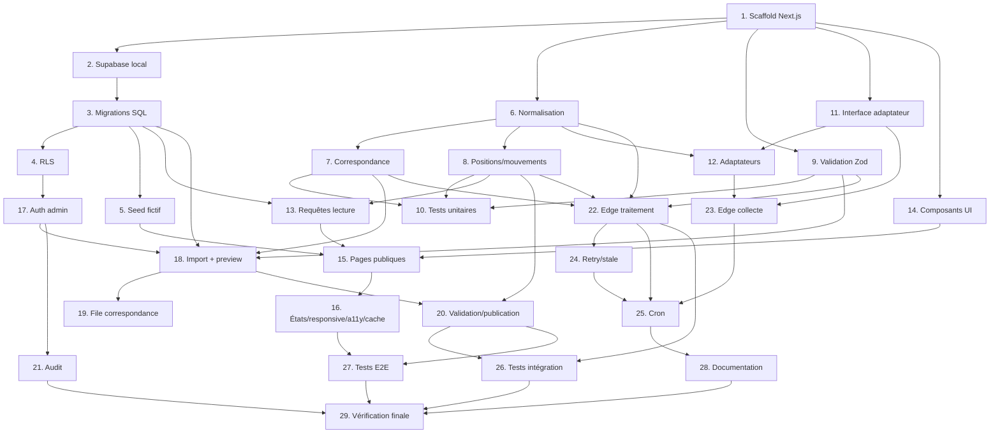

# Implementation Plan: classements-hmi

## Overview

Module de classements musicaux hebdomadaires (5 plateformes) sur **Next.js + TypeScript**
et **Supabase (PostgreSQL, RLS, Edge Functions, Cron)**, développé **local-first** dans
le dossier `app-next/` sans casser l'existant statique. L'ordre suit les étapes du cahier
des charges : setup/audit → base de données → UI (données fictives) → administration →
Apple Music → YouTube → Spotify/Audiomack/TikTok → automatisation → documentation.

Principes non négociables appliqués partout : jamais d'API inventée, distinction
plateforme/contexte/méthode, jamais de fausse donnée, secrets côté serveur, import
administratif vérifié par défaut.

## Tasks

- [x] 1. Échafauder l'application Next.js sans toucher à l'existant
  - Créer `app-next/` avec Next.js (App Router) + TypeScript + ESLint (`create-next-app`)
  - Configurer `tsconfig`, `next.config.mjs`, alias `@/*`, structure `src/`
  - Ajouter Zod, client Supabase (`@supabase/supabase-js`, `@supabase/ssr`) aux dépendances
  - Vérifier que le site statique racine reste intact (aucun fichier existant modifié)
  - _Requirements: 1.1, 1.6, 24.1, 24.2_

- [x] 2. Initialiser Supabase en local (local-first)
  - `supabase init` dans `app-next/` ; config `supabase/config.toml`
  - Documenter `supabase start` (Docker) et récupérer les clés locales dans `.env.local`
  - Créer `src/lib/supabase/{server,client,admin}.ts` (helpers SSR + service role serveur)
  - _Requirements: 1.2, 19.3, 19.4_

- [x] 3. Créer les migrations SQL du schéma
  - Enum `artist_haitian_status` ; tables `artists`, `tracks`, `track_artists`, `platform_tracks`
  - Tables `chart_sources`, `chart_editions`, `chart_entries`, `chart_imports`, `chart_match_queue`, `sync_runs`, `chart_audit_logs`
  - Contraintes `unique(platform, external_id)`, `unique(chart_edition_id, track_id)`, `unique(chart_edition_id, filtered_position)`, `unique(chart_source_id, period_start, period_end)`, `unique(isrc) where isrc is not null`
  - Index (`normalized_title`, `release_date`) ; commentaires de colonnes
  - _Requirements: 1.3, 7.1, 7.2, 7.3, 7.4, 7.5, 7.6_

- [x] 4. Politiques RLS (lecture publique restreinte, écriture admin)
  - Activer RLS sur toutes les tables du module
  - Lecture anon : uniquement lignes rattachées à une Edition `published`
  - Écriture : rôle `admin` (claim Supabase Auth) pour import/correction/validation/publication/rollback/sources
  - _Requirements: 19.1, 19.2, 19.5_

- [x] 5. Semer des données fictives explicites
  - Seed `chart_sources` (les 6 `source_key`), artistes `Artiste Test HMI`, chansons `Chanson Test A/B/...`
  - Créer au moins deux éditions publiées par source (semaine courante + précédente) pour tester l'historique
  - Interdire toute donnée réelle copiée de GlobHaitian
  - _Requirements: 23.4, 7.6_

- [x] 6. Normalisation des titres et artistes (fonctions pures)
  - `src/lib/charts/normalization/normalize-title.ts` (minuscules, accents pour comparaison, espaces, retrait mentions décoratives, conservation `remix/live/acoustic/sped up/slowed/instrumental`)
  - `normalize-artists.ts` (séparation, ordre de facturation, rôles)
  - _Requirements: 8.2_

- [x] 7. Correspondance et score de confiance
  - `matching/confidence.ts` (calcul 0..1) et `match-track.ts` (ordre : ISRC → platform_track → artiste+titre → durée → date → album → humain)
  - Routage `< 0.80` vers `chart_match_queue` ; `≥ 0.95` auto
  - `match-artist.ts` pour l'éligibilité haïtienne (primary/co_primary vérifié)
  - _Requirements: 8.1, 8.3, 8.4, 8.5, 6.2, 6.3, 6.4_

- [x] 8. Calcul des positions filtrées, mouvements et historique
  - `ranking/calculate-filtered-positions.ts` (tri par source_position, 1..N, pas de remplissage)
  - `ranking/calculate-movement.ts` (movement, entry_status new/up/down/stable/reentry/exit)
  - `ranking/calculate-chart-history.ts` (peak, weeks_on_chart, consecutive_weeks) ; gestion des familles de versions
  - _Requirements: 9.1, 9.2, 9.3, 9.4, 10.1, 10.2, 10.3, 10.4, 10.5, 8.6, 4.5_

- [x] 9. Schémas de validation Zod et validation d'édition
  - `validation/schemas.ts` (réponses API, CSV/JSON, params de routes, env, données admin)
  - `validation/validate-edition.ts` (refus si positions/chansons dupliquées, position < 1, période incohérente, artiste non vérifié, sans correspondance, source non identifiée, > 20 filtrées, autre semaine)
  - Rejet d'entrée sans `source_position/track_title/artist_names/source_period/source_identifier|url`
  - _Requirements: 21.1, 21.2, 13.4_

- [x] 10. Tests unitaires du cœur (dont propriétés)
  - Tester normalisation, mouvements, new/reentry, peak, semaines, filtrage haïtien, doublons, ISRC, validation, versions
  - Encoder les propriétés de correctness 1–15 du design
  - _Requirements: 23.1_

- [x] 11. Interface d'adaptateur et registre
  - `adapters/types.ts` (`ChartSourceAdapter`, `IngestionMode`, `PlatformName`, DTOs)
  - Registre + wrapper d'isolation (une erreur d'adaptateur n'affecte pas les autres, journal `sync_runs`)
  - _Requirements: 5.1, 5.2, 5.3_

- [x] 12. Adaptateurs par plateforme (mode manuel par défaut)
  - `youtube.ts` (2 sources : `youtube_haiti_official` import + `youtube_hmi_weekly_delta` API, tri weekly_view_delta, liste blanche vidéos officielles)
  - `spotify.ts` (import + enrichissement Web API, jamais de streams inventés)
  - `audiomack.ts` (import ; `AUDIOMACK_HAITI_CHART_ENDPOINT` vide ; global ≠ Haïti)
  - `apple-music.ts` (OFFICIAL_API, test storefront `ht`, sinon HMI Worldwide, pas de bascule silencieuse)
  - `tiktok.ts` (import ; posts_count ≠ streams ; sons incertains → file)
  - Les modes manuels renvoient `manual_import_required`
  - _Requirements: 2.1, 2.2, 2.4, 3.2, 3.3, 3.4, 3.5, 3.6, 14.1, 14.2, 14.3, 14.4, 14.5, 14.6_

- [x] 13. Requêtes de lecture agrégée
  - `queries/get-chart-overview.ts` (une requête pour les 5 Top 10, published only)
  - `queries/get-platform-chart.ts` (Top 20 + détails) ; `queries/get-chart-history.ts`
  - _Requirements: 18.2, 18.3_

- [x] 14. Composants d'interface des classements
  - `ChartsPageHeader`, `PlatformChartRow`, `TrackChartCard`, `ChartMovementBadge`, `ChartSourceBadge`, `ChartUpdatedAt`, `ChartTop20Table`, `ChartWeekSelector`, `ChartEmptyState`, `ChartStaleWarning`, `ChartMethodologyModal`
  - Réutiliser le design existant (palette, StageLightsOverlay décoratif, pochette non recadrée, numéro HMI à côté)
  - _Requirements: 17.1, 17.2, 17.3, 17.6, 3.1_

- [x] 15. Pages publiques
  - `/charts` (5 rangées, Top 10, bouton Top 20, ordre YouTube/Spotify/Audiomack/Apple/TikTok)
  - `/charts/[platform]` (Top 20 complet + détails + sélecteur de semaine + méthode)
  - `/charts/methodology` (5 plateformes détaillées + déclaration d'indépendance)
  - Filtre territorial affiché seulement si données réelles
  - _Requirements: 15.1, 15.2, 15.3, 15.4, 15.5, 16.1, 16.2_

- [x] 16. États, responsive, accessibilité et cache
  - Skeletons, empty, stale, error par rangée (source manquante ne bloque pas la page)
  - Desktop carrousel / mobile swipe 1,3–1,7 carte, zones tactiles ≥ 44px, pas de débordement horizontal
  - Navigation clavier, ARIA, contraste, alt pochettes, évolution icône+texte+couleur, prefers-reduced-motion
  - Cache Next.js + revalidation par tag ; aucun appel tiers ni clé côté navigateur
  - _Requirements: 4.2, 17.4, 17.5, 18.1, 18.4, 18.5, 11.4_

- [x] 17. Authentification et protection admin
  - Auth Supabase + rôle `admin` ; middleware protégeant `/admin/**`
  - Redirection non authentifié / non admin
  - _Requirements: 19.2, 19.5_

- [x] 18. Import administratif + prévisualisation + templates
  - `/admin/charts/import` : upload CSV/JSON + saisie manuelle structurée ; `process-chart-import`
  - Prévisualisation obligatoire (position source, titre, artiste, chanson proposée, confiance, statut haïtien, erreurs, doublons, diff semaine précédente)
  - Templates téléchargeables distincts par plateforme
  - _Requirements: 13.1, 13.2, 13.3, 2.1_

- [x] 19. File de correspondance (review)
  - `/admin/charts/review` : résoudre les correspondances `chart_match_queue`, valider/associer les chansons
  - _Requirements: 8.4, 8.5, 3.6_

- [x] 20. Validation, publication, rollback, sources, historique
  - `/admin/charts` (tableau de bord), `/admin/charts/sources`, `/admin/charts/history`
  - Actions valider → publier (recalcul mouvements/peaks/semaines + invalidation cache) → rollback
  - Conservation dernière édition valide + badge « Mise à jour en attente »
  - _Requirements: 4.1, 4.2, 4.3, 4.4, 11.3, 11.4_

- [x] 21. Journalisation d'audit
  - Écrire `chart_audit_logs` pour import/correction/validation/publication/rollback (user, action, entités, old/new, motif)
  - _Requirements: 22.1_

- [x] 22. Edge Functions de traitement
  - `process-chart-import`, `normalize-chart-entries`, `match-chart-tracks`, `validate-chart-edition`, `publish-chart-edition`
  - Traitement par petits lots (limites plan gratuit)
  - _Requirements: 12.1, 12.3_

- [x] 23. Edge Functions de collecte
  - `collect-youtube-chart`, `collect-youtube-video-stats` (API, weekly_view_delta), `collect-apple-music-chart` (API, test `ht`)
  - `collect-spotify-chart`, `collect-audiomack-chart`, `collect-tiktok-chart` → `manual_import_required` en mode manuel (aucun faux succès)
  - _Requirements: 12.1, 12.4, 2.4, 14.1, 14.5_

- [x] 24. Reprises et péremption
  - `retry-failed-chart-runs` (backoff 1m/5m/30m/2h/12h, respect `Retry-After`, alerte après épuisement)
  - `mark-stale-chart-editions` (marque `is_stale`, badge « Mise à jour en attente », conserve dernière valide)
  - Mapping erreurs 400/401/403/404/409/429/500/502/503 dans `sync_runs`
  - _Requirements: 20.1, 20.2, 20.3, 4.1, 4.2_

- [x] 25. Orchestration Supabase Cron
  - `pg_cron` + `pg_net` : vendredi (clôture+collecte), samedi (retry+enrichissement+match), dimanche (imports+résolution+vérif+validation), lundi (publication+archivage+recalcul+cache)
  - Config `publication_day/time/timezone` (IANA `America/Port-au-Prince`), périodes UTC
  - _Requirements: 11.1, 11.2, 11.3, 11.4, 12.2_

- [x] 26. Tests d'intégration
  - Création édition, import CSV, correspondance auto, validation, publication, rollback, lecture publique, échec d'une source, conservation dernière édition
  - _Requirements: 23.2, 5.2_

- [x] 27. Tests end-to-end (Playwright)
  - `/charts` (5 rangées), ouverture Top 20, changement de semaine, mobile, source indisponible, badge stale, admin protégée, import, publication
  - _Requirements: 23.3_

- [x] 28. Documentation
  - `README_CHARTS.md`, `CHARTS_METHODOLOGY.md`, `CHARTS_ADMIN_GUIDE.md`, `CHARTS_ENVIRONMENT_VARIABLES.md`
  - _Requirements: 16.1, 19.3_

- [x] 29. Vérification finale et build
  - `get_diagnostics` sur le module ; `next build` sans erreur ; lint + type-check
  - Contrôle des critères d'acceptation (5 rangées, Top 20, positions source/filtrée, secrets serveur, non-régression existant)
  - _Requirements: 1.5, 1.6, 24.1, 24.2, 24.3_

## Task Dependency Graph



```json
{
  "waves": [
    { "wave": 1, "tasks": ["1"] },
    { "wave": 2, "tasks": ["2", "6", "9", "11", "14"] },
    { "wave": 3, "tasks": ["3", "7", "8", "12"] },
    { "wave": 4, "tasks": ["4", "5", "10", "13"] },
    { "wave": 5, "tasks": ["15", "17", "22", "23"] },
    { "wave": 6, "tasks": ["16", "18", "21", "24"] },
    { "wave": 7, "tasks": ["19", "20", "25"] },
    { "wave": 8, "tasks": ["26", "27", "28"] },
    { "wave": 9, "tasks": ["29"] }
  ]
}
```

## Notes

- **Local-first** : Docker Desktop requis pour `supabase start`. Aucun secret plateforme au départ ; tous les adaptateurs démarrent en mode `VERIFIED_ADMIN_IMPORT`/manuel.
- **Non-régression** : tout le module vit dans `app-next/` ; le site statique racine et la collecte JSON actuelle restent inchangés jusqu'à une bascule d'hébergement validée séparément.
- **Sécurité** : secrets uniquement côté serveur (jamais `NEXT_PUBLIC_*`). La clé service Supabase ne circule jamais côté navigateur.
- **Honnêteté** : aucune fonction de collecte ne simule un succès ; Audiomack global n'est jamais nommé « Haïti » ; TikTok mesure des publications, pas des streams ; YouTube `mostPopular` n'est pas présenté comme YouTube Music Charts Haïti.
```
