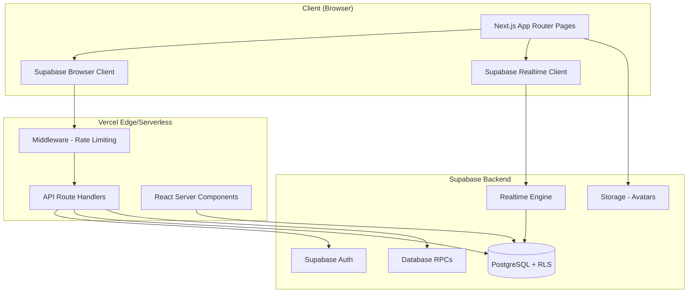
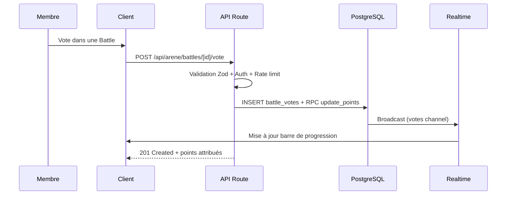
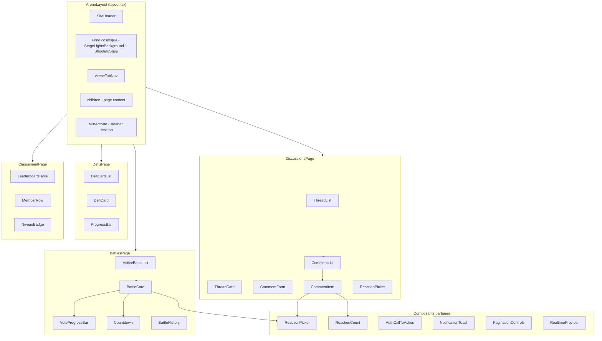
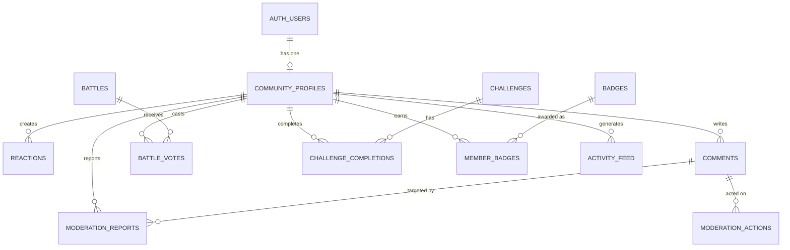

# Design Document: Community Interactions Arena

## Overview

L'arène d'interactions communautaires est un module social intégré à Planète HMI permettant aux fans de musique haïtienne d'interagir entre eux via des réactions, commentaires, votes (battles), défis gamifiés et un système de réputation à niveaux cosmiques. Le module s'appuie sur l'infrastructure existante (Next.js 16, Supabase avec RLS, composants visuels cosmiques) et ajoute une couche temps réel via Supabase Realtime.

### Design Decisions

| Décision | Choix | Justification |
|----------|-------|---------------|
| Temps réel | Supabase Realtime (PostgreSQL changes) | Déjà dans la stack, pas de serveur WebSocket additionnel |
| Rate limiting | Middleware Next.js + table `rate_limits` | Vercel ne propose pas de rate limiting natif sur les API routes |
| Gamification | Calcul côté serveur via RPC PostgreSQL | Intégrité des points garantie, pas de manipulation client |
| Modération | Filtre texte côté API + signalements communautaires | Double protection : automatique + humaine |
| Cache classement | Supabase Materialized View + revalidation ISR | Évite les requêtes lourdes à chaque affichage |
| File upload (avatar) | Supabase Storage avec policies | Cohérent avec le reste de l'infra |

## Architecture

### High-Level System Diagram



### Data Flow



### Route Architecture

```
/arene                          → Layout avec navigation par onglets
  /arene/battles               → Liste des battles (actives + historique)
  /arene/defis                 → Défis communautaires actifs
  /arene/discussions           → Fils de discussion
  /arene/classement-membres    → Leaderboard

/admin/arene                   → Dashboard modération
  /admin/arene/battles         → Gestion battles (CRUD)
  /admin/arene/defis           → Gestion défis (CRUD)
  /admin/arene/moderation      → File de modération
  /admin/arene/badges          → Gestion badges
  /admin/arene/termes-interdits → Liste noire

/api/arene/                    → API Routes
  /api/arene/profile           → GET/PATCH profil communautaire
  /api/arene/reactions         → POST/DELETE réactions
  /api/arene/comments          → GET/POST/DELETE commentaires
  /api/arene/battles/[id]/vote → POST vote
  /api/arene/activity          → GET mur d'activité
  /api/arene/leaderboard       → GET classement
  /api/admin/arene/battles     → CRUD battles (admin)
  /api/admin/arene/challenges  → CRUD défis (admin)
  /api/admin/arene/moderation  → Actions modération (admin)
  /api/admin/arene/badges      → CRUD badges (admin)
  /api/admin/arene/banned-terms → CRUD termes interdits (admin)
```

## Components and Interfaces

### Frontend Component Hierarchy



### Key Component Interfaces

```typescript
// === Contexte Realtime ===
interface RealtimeContextValue {
  subscribe(channel: string, event: string, callback: (payload: unknown) => void): () => void;
  connectionStatus: 'connected' | 'disconnected' | 'reconnecting';
}

// === Battle Components ===
interface BattleCardProps {
  battle: Battle;
  userVote: string | null; // side_a ou side_b, null si pas voté
  onVote: (side: 'side_a' | 'side_b') => void;
  isAuthenticated: boolean;
}

interface VoteProgressBarProps {
  votesA: number;
  votesB: number;
  animated?: boolean;
}

interface CountdownProps {
  endsAt: string; // ISO timestamp
  onExpired?: () => void;
}

// === Reactions ===
interface ReactionPickerProps {
  contentType: 'song' | 'comment' | 'battle';
  contentId: string;
  currentReactions: ReactionSummary[];
  userReactions: string[]; // types déjà posés par l'utilisateur
  onReact: (type: ReactionType) => void;
  disabled?: boolean;
}

type ReactionType = 'star' | 'fire' | 'rocket' | 'planet' | 'magic' | 'heart';

interface ReactionSummary {
  type: ReactionType;
  count: number;
}

// === Comments ===
interface CommentFormProps {
  threadId: string;
  onSubmit: (text: string) => Promise<void>;
  disabled?: boolean;
  maxLength: number;
}

interface CommentItemProps {
  comment: Comment;
  isAuthor: boolean;
  onDelete?: () => void;
  onReport?: (reason: ReportReason) => void;
}

// === Activity Feed ===
interface MurActiviteProps {
  initialItems: ActivityItem[];
  mode: 'sidebar' | 'fullwidth';
}

interface ActivityItem {
  id: string;
  type: 'reaction' | 'comment' | 'vote' | 'badge' | 'new_member' | 'new_chart';
  actorPseudo: string;
  actorNiveau: Niveau;
  targetLabel: string;
  targetUrl?: string;
  createdAt: string;
  groupCount?: number; // pour les activités regroupées
}

// === Profile ===
interface CommunityProfile {
  id: string;
  memberId: string;
  pseudo: string;
  avatarUrl: string | null;
  niveau: Niveau;
  pointsCosmiques: number;
  badges: Badge[];
  stats: {
    commentCount: number;
    voteCount: number;
    reactionCount: number;
  };
}

type Niveau = 'etoile' | 'constellation' | 'nebuleuse' | 'galaxie' | 'univers';
```

### API Route Handler Pattern

Chaque route handler suit le pattern existant du projet :

```typescript
// Pattern standard pour les routes publiques avec auth optionnelle
export async function POST(request: Request) {
  // 1. Rate limiting (middleware ou in-handler)
  // 2. Auth check
  const supabase = await createClient();
  const { data: { user } } = await supabase.auth.getUser();
  if (!user) return NextResponse.json({ error: { code: "unauthorized", message: "Authentification requise." } }, { status: 401 });

  // 3. Validation Zod
  const body = await request.json();
  const parsed = schema.safeParse(body);
  if (!parsed.success) return NextResponse.json({ error: { code: "validation_error", message: "Données invalides.", details: parsed.error.issues } }, { status: 400 });

  // 4. Business logic (RPC ou queries)
  // 5. Response
}

// Pattern admin (identique à l'existant)
export async function POST(request: Request) {
  const auth = await requireAdmin();
  if (!auth.ok) return NextResponse.json({ error: { code: auth.status === 401 ? "unauthorized" : "forbidden", message: auth.error } }, { status: auth.status });
  // ...
}
```

### Supabase Realtime Integration Strategy

```typescript
// src/lib/arene/realtime.ts
"use client";

import { createClient } from "@/lib/supabase/client";
import type { RealtimeChannel } from "@supabase/supabase-js";

const MAX_SUBSCRIPTIONS = 5;

/**
 * Gestionnaire de souscriptions Realtime pour l'Arène.
 * Garantit un maximum de 5 souscriptions simultanées.
 * Nettoyage automatique lors de la navigation (via useEffect cleanup).
 */
export class AreneRealtimeManager {
  private channels: Map<string, RealtimeChannel> = new Map();
  private supabase = createClient();
  private reconnectAttempts = 0;
  private maxReconnectAttempts = 5;
  private reconnectInterval = 5000; // 5s

  subscribe(channelName: string, table: string, filter: string, callback: (payload: unknown) => void): () => void {
    if (this.channels.size >= MAX_SUBSCRIPTIONS) {
      // Fermer la plus ancienne souscription
      const oldest = this.channels.keys().next().value;
      if (oldest) this.unsubscribe(oldest);
    }

    const channel = this.supabase
      .channel(channelName)
      .on('postgres_changes', { event: '*', schema: 'public', table, filter }, callback)
      .subscribe((status) => {
        if (status === 'CHANNEL_ERROR') this.handleDisconnect(channelName, table, filter, callback);
      });

    this.channels.set(channelName, channel);
    return () => this.unsubscribe(channelName);
  }

  private unsubscribe(channelName: string) {
    const channel = this.channels.get(channelName);
    if (channel) {
      this.supabase.removeChannel(channel);
      this.channels.delete(channelName);
    }
  }

  private handleDisconnect(channelName: string, table: string, filter: string, callback: (payload: unknown) => void) {
    if (this.reconnectAttempts >= this.maxReconnectAttempts) return;
    this.reconnectAttempts++;
    setTimeout(() => {
      this.unsubscribe(channelName);
      this.subscribe(channelName, table, filter, callback);
    }, this.reconnectInterval);
  }

  cleanup() {
    for (const [name] of this.channels) {
      this.unsubscribe(name);
    }
    this.reconnectAttempts = 0;
  }
}
```

## Data Models

### Entity Relationship Diagram



### PostgreSQL Schema

#### Table: `community_profiles`

```sql
CREATE TABLE community_profiles (
  id UUID PRIMARY KEY DEFAULT gen_random_uuid(),
  member_id UUID NOT NULL UNIQUE REFERENCES auth.users(id) ON DELETE CASCADE,
  pseudo VARCHAR(30) NOT NULL UNIQUE,
  avatar_url TEXT,
  niveau VARCHAR(20) NOT NULL DEFAULT 'etoile'
    CHECK (niveau IN ('etoile', 'constellation', 'nebuleuse', 'galaxie', 'univers')),
  points_cosmiques INTEGER NOT NULL DEFAULT 0 CHECK (points_cosmiques >= 0),
  comment_count INTEGER NOT NULL DEFAULT 0,
  vote_count INTEGER NOT NULL DEFAULT 0,
  reaction_count INTEGER NOT NULL DEFAULT 0,
  is_suspended BOOLEAN NOT NULL DEFAULT false,
  suspended_until TIMESTAMPTZ,
  created_at TIMESTAMPTZ NOT NULL DEFAULT now(),
  updated_at TIMESTAMPTZ NOT NULL DEFAULT now()
);

CREATE INDEX idx_profiles_points ON community_profiles(points_cosmiques DESC);
CREATE INDEX idx_profiles_pseudo ON community_profiles(pseudo);
```

#### Table: `reactions`

```sql
CREATE TABLE reactions (
  id UUID PRIMARY KEY DEFAULT gen_random_uuid(),
  member_id UUID NOT NULL REFERENCES auth.users(id) ON DELETE CASCADE,
  content_type VARCHAR(20) NOT NULL CHECK (content_type IN ('song', 'comment', 'battle')),
  content_id UUID NOT NULL,
  reaction_type VARCHAR(20) NOT NULL
    CHECK (reaction_type IN ('star', 'fire', 'rocket', 'planet', 'magic', 'heart')),
  created_at TIMESTAMPTZ NOT NULL DEFAULT now(),
  UNIQUE(member_id, content_type, content_id, reaction_type)
);

CREATE INDEX idx_reactions_content ON reactions(content_type, content_id);
CREATE INDEX idx_reactions_member_date ON reactions(member_id, created_at);
```

#### Table: `comments`

```sql
CREATE TABLE comments (
  id UUID PRIMARY KEY DEFAULT gen_random_uuid(),
  member_id UUID NOT NULL REFERENCES auth.users(id) ON DELETE CASCADE,
  thread_type VARCHAR(20) NOT NULL CHECK (thread_type IN ('song', 'battle', 'challenge', 'free')),
  thread_id UUID NOT NULL,
  body TEXT NOT NULL CHECK (char_length(body) BETWEEN 1 AND 500),
  status VARCHAR(20) NOT NULL DEFAULT 'published'
    CHECK (status IN ('published', 'hidden', 'deleted')),
  report_count INTEGER NOT NULL DEFAULT 0,
  created_at TIMESTAMPTZ NOT NULL DEFAULT now()
);

CREATE INDEX idx_comments_thread ON comments(thread_type, thread_id, created_at DESC);
CREATE INDEX idx_comments_member ON comments(member_id);
CREATE INDEX idx_comments_moderation ON comments(status, report_count) WHERE status = 'hidden';
```

#### Table: `battles`

```sql
CREATE TABLE battles (
  id UUID PRIMARY KEY DEFAULT gen_random_uuid(),
  title VARCHAR(100) NOT NULL,
  description VARCHAR(500),
  side_a_type VARCHAR(20) NOT NULL CHECK (side_a_type IN ('artist', 'song')),
  side_a_id UUID NOT NULL,
  side_a_label VARCHAR(200) NOT NULL,
  side_a_image_url TEXT,
  side_b_type VARCHAR(20) NOT NULL CHECK (side_b_type IN ('artist', 'song')),
  side_b_id UUID NOT NULL,
  side_b_label VARCHAR(200) NOT NULL,
  side_b_image_url TEXT,
  votes_a INTEGER NOT NULL DEFAULT 0,
  votes_b INTEGER NOT NULL DEFAULT 0,
  status VARCHAR(20) NOT NULL DEFAULT 'active'
    CHECK (status IN ('active', 'ended', 'cancelled')),
  duration_hours INTEGER NOT NULL CHECK (duration_hours IN (24, 48, 72)),
  starts_at TIMESTAMPTZ NOT NULL DEFAULT now(),
  ends_at TIMESTAMPTZ NOT NULL,
  winner VARCHAR(10) CHECK (winner IN ('side_a', 'side_b', 'tie', NULL)),
  created_by UUID NOT NULL REFERENCES auth.users(id),
  created_at TIMESTAMPTZ NOT NULL DEFAULT now()
);

CREATE INDEX idx_battles_status ON battles(status, ends_at);
CREATE INDEX idx_battles_active ON battles(status) WHERE status = 'active';
```

#### Table: `battle_votes`

```sql
CREATE TABLE battle_votes (
  id UUID PRIMARY KEY DEFAULT gen_random_uuid(),
  member_id UUID NOT NULL REFERENCES auth.users(id) ON DELETE CASCADE,
  battle_id UUID NOT NULL REFERENCES battles(id) ON DELETE CASCADE,
  side VARCHAR(10) NOT NULL CHECK (side IN ('side_a', 'side_b')),
  created_at TIMESTAMPTZ NOT NULL DEFAULT now(),
  UNIQUE(member_id, battle_id)
);

CREATE INDEX idx_votes_battle ON battle_votes(battle_id);
```

#### Table: `challenges`

```sql
CREATE TABLE challenges (
  id UUID PRIMARY KEY DEFAULT gen_random_uuid(),
  title VARCHAR(100) NOT NULL,
  description VARCHAR(500),
  challenge_type VARCHAR(30) NOT NULL
    CHECK (challenge_type IN ('vote_battles', 'comment_songs', 'react_contents', 'consecutive_days')),
  target_count INTEGER NOT NULL CHECK (target_count BETWEEN 1 AND 100),
  reward_points INTEGER NOT NULL CHECK (reward_points BETWEEN 1 AND 10000),
  status VARCHAR(20) NOT NULL DEFAULT 'active'
    CHECK (status IN ('draft', 'active', 'ended')),
  starts_at TIMESTAMPTZ NOT NULL DEFAULT now(),
  ends_at TIMESTAMPTZ NOT NULL,
  participant_count INTEGER NOT NULL DEFAULT 0,
  created_by UUID NOT NULL REFERENCES auth.users(id),
  created_at TIMESTAMPTZ NOT NULL DEFAULT now()
);

CREATE INDEX idx_challenges_status ON challenges(status, ends_at);
```

#### Table: `challenge_completions`

```sql
CREATE TABLE challenge_completions (
  id UUID PRIMARY KEY DEFAULT gen_random_uuid(),
  member_id UUID NOT NULL REFERENCES auth.users(id) ON DELETE CASCADE,
  challenge_id UUID NOT NULL REFERENCES challenges(id) ON DELETE CASCADE,
  progress INTEGER NOT NULL DEFAULT 0,
  completed BOOLEAN NOT NULL DEFAULT false,
  completed_at TIMESTAMPTZ,
  created_at TIMESTAMPTZ NOT NULL DEFAULT now(),
  updated_at TIMESTAMPTZ NOT NULL DEFAULT now(),
  UNIQUE(member_id, challenge_id)
);
```

#### Table: `badges`

```sql
CREATE TABLE badges (
  id UUID PRIMARY KEY DEFAULT gen_random_uuid(),
  name VARCHAR(50) NOT NULL,
  description VARCHAR(200) NOT NULL,
  icon_url TEXT NOT NULL,
  badge_type VARCHAR(30) NOT NULL
    CHECK (badge_type IN ('first_comment', 'first_vote', '10_battles', '50_reactions',
      '7_days_streak', 'challenge_complete', 'level_up', 'special')),
  condition_value INTEGER, -- pour les badges avec seuil (10, 50, 7...)
  is_special BOOLEAN NOT NULL DEFAULT false,
  created_at TIMESTAMPTZ NOT NULL DEFAULT now()
);
```

#### Table: `member_badges`

```sql
CREATE TABLE member_badges (
  id UUID PRIMARY KEY DEFAULT gen_random_uuid(),
  member_id UUID NOT NULL REFERENCES auth.users(id) ON DELETE CASCADE,
  badge_id UUID NOT NULL REFERENCES badges(id) ON DELETE CASCADE,
  created_at TIMESTAMPTZ NOT NULL DEFAULT now(),
  UNIQUE(member_id, badge_id)
);
```

#### Table: `activity_feed`

```sql
CREATE TABLE activity_feed (
  id UUID PRIMARY KEY DEFAULT gen_random_uuid(),
  actor_id UUID REFERENCES auth.users(id) ON DELETE SET NULL,
  activity_type VARCHAR(30) NOT NULL
    CHECK (activity_type IN ('reaction', 'comment', 'vote', 'badge_earned',
      'new_member', 'new_chart', 'challenge_complete')),
  target_type VARCHAR(30),
  target_id UUID,
  target_label TEXT,
  metadata JSONB DEFAULT '{}',
  created_at TIMESTAMPTZ NOT NULL DEFAULT now()
);

CREATE INDEX idx_activity_feed_date ON activity_feed(created_at DESC);
CREATE INDEX idx_activity_feed_grouping ON activity_feed(activity_type, target_type, target_id, created_at);
```

#### Table: `moderation_reports`

```sql
CREATE TABLE moderation_reports (
  id UUID PRIMARY KEY DEFAULT gen_random_uuid(),
  reporter_id UUID NOT NULL REFERENCES auth.users(id) ON DELETE CASCADE,
  comment_id UUID NOT NULL REFERENCES comments(id) ON DELETE CASCADE,
  reason VARCHAR(30) NOT NULL
    CHECK (reason IN ('insulte', 'spam', 'discours_haineux', 'autre')),
  created_at TIMESTAMPTZ NOT NULL DEFAULT now(),
  UNIQUE(reporter_id, comment_id)
);

CREATE INDEX idx_reports_comment ON moderation_reports(comment_id);
```

#### Table: `moderation_actions`

```sql
CREATE TABLE moderation_actions (
  id UUID PRIMARY KEY DEFAULT gen_random_uuid(),
  admin_id UUID NOT NULL REFERENCES auth.users(id),
  comment_id UUID NOT NULL REFERENCES comments(id) ON DELETE CASCADE,
  action VARCHAR(20) NOT NULL CHECK (action IN ('validate', 'delete', 'restore')),
  reason TEXT,
  created_at TIMESTAMPTZ NOT NULL DEFAULT now()
);
```

#### Table: `banned_terms`

```sql
CREATE TABLE banned_terms (
  id UUID PRIMARY KEY DEFAULT gen_random_uuid(),
  term VARCHAR(100) NOT NULL UNIQUE,
  created_at TIMESTAMPTZ NOT NULL DEFAULT now()
);
```

#### Table: `daily_points_log`

```sql
CREATE TABLE daily_points_log (
  id UUID PRIMARY KEY DEFAULT gen_random_uuid(),
  member_id UUID NOT NULL REFERENCES auth.users(id) ON DELETE CASCADE,
  category VARCHAR(20) NOT NULL CHECK (category IN ('reaction', 'comment', 'vote', 'challenge')),
  points_earned INTEGER NOT NULL DEFAULT 0,
  log_date DATE NOT NULL DEFAULT CURRENT_DATE,
  UNIQUE(member_id, category, log_date)
);

CREATE INDEX idx_daily_points ON daily_points_log(member_id, log_date);
```

#### Table: `notifications`

```sql
CREATE TABLE notifications (
  id UUID PRIMARY KEY DEFAULT gen_random_uuid(),
  member_id UUID NOT NULL REFERENCES auth.users(id) ON DELETE CASCADE,
  type VARCHAR(30) NOT NULL
    CHECK (type IN ('badge_earned', 'level_up', 'comment_deleted', 'suspension', 'challenge_reward')),
  title TEXT NOT NULL,
  body TEXT,
  read BOOLEAN NOT NULL DEFAULT false,
  metadata JSONB DEFAULT '{}',
  created_at TIMESTAMPTZ NOT NULL DEFAULT now()
);

CREATE INDEX idx_notifications_member ON notifications(member_id, read, created_at DESC);
```

### Key RPC Functions

```sql
-- Attribuer des points avec vérification des plafonds quotidiens
CREATE OR REPLACE FUNCTION award_points(
  p_member_id UUID,
  p_category VARCHAR(20),
  p_points INTEGER
) RETURNS JSONB AS $$
DECLARE
  v_daily_total INTEGER;
  v_cap INTEGER;
  v_remaining INTEGER;
  v_awarded INTEGER;
  v_new_total INTEGER;
  v_old_niveau VARCHAR(20);
  v_new_niveau VARCHAR(20);
BEGIN
  -- Déterminer le plafond
  v_cap := CASE p_category
    WHEN 'reaction' THEN 50
    WHEN 'comment' THEN 40
    ELSE NULL -- pas de plafond pour vote/challenge
  END;

  -- Calculer le total du jour
  SELECT COALESCE(SUM(points_earned), 0) INTO v_daily_total
  FROM daily_points_log
  WHERE member_id = p_member_id AND category = p_category AND log_date = CURRENT_DATE;

  -- Calculer les points à attribuer
  IF v_cap IS NOT NULL AND v_daily_total >= v_cap THEN
    RETURN jsonb_build_object('awarded', 0, 'cap_reached', true);
  END IF;

  v_remaining := CASE WHEN v_cap IS NOT NULL THEN v_cap - v_daily_total ELSE p_points END;
  v_awarded := LEAST(p_points, v_remaining);

  -- Enregistrer dans le log
  INSERT INTO daily_points_log (member_id, category, points_earned, log_date)
  VALUES (p_member_id, p_category, v_awarded, CURRENT_DATE)
  ON CONFLICT (member_id, category, log_date)
  DO UPDATE SET points_earned = daily_points_log.points_earned + v_awarded;

  -- Mettre à jour le profil
  SELECT niveau INTO v_old_niveau FROM community_profiles WHERE member_id = p_member_id;

  UPDATE community_profiles
  SET points_cosmiques = points_cosmiques + v_awarded,
      updated_at = now()
  WHERE member_id = p_member_id
  RETURNING points_cosmiques INTO v_new_total;

  -- Déterminer le nouveau niveau
  v_new_niveau := CASE
    WHEN v_new_total >= 5000 THEN 'univers'
    WHEN v_new_total >= 1500 THEN 'galaxie'
    WHEN v_new_total >= 500 THEN 'nebuleuse'
    WHEN v_new_total >= 100 THEN 'constellation'
    ELSE 'etoile'
  END;

  -- Mettre à jour le niveau si changement
  IF v_new_niveau != v_old_niveau THEN
    UPDATE community_profiles SET niveau = v_new_niveau WHERE member_id = p_member_id;
  END IF;

  RETURN jsonb_build_object(
    'awarded', v_awarded,
    'new_total', v_new_total,
    'cap_reached', v_cap IS NOT NULL AND (v_daily_total + v_awarded) >= v_cap,
    'level_up', v_new_niveau != v_old_niveau,
    'new_niveau', v_new_niveau
  );
END;
$$ LANGUAGE plpgsql SECURITY DEFINER;
```

### RLS Policies Summary

| Table | SELECT | INSERT | UPDATE | DELETE |
|-------|--------|--------|--------|--------|
| community_profiles | all | auth (own) | auth (own) | — |
| reactions | all | auth (own) | — | auth (own) |
| comments (published) | all | auth (own) | — | auth (own) |
| battles | all | admin | admin | admin |
| battle_votes | all | auth (own) | — | — |
| challenges | all | admin | admin | — |
| challenge_completions | all | auth (own) | auth (own) | — |
| badges | all | admin | admin | — |
| member_badges | all | system (RPC) | — | — |
| activity_feed | all | system (RPC) | — | — |
| moderation_reports | admin | auth (own) | — | — |
| notifications | auth (own) | system (RPC) | auth (own: read) | — |
| banned_terms | admin | admin | admin | admin |

## Correctness Properties

*A property is a characteristic or behavior that should hold true across all valid executions of a system — essentially, a formal statement about what the system should do. Properties serve as the bridge between human-readable specifications and machine-verifiable correctness guarantees.*

### Property 1: Pseudo validation

*For any* string, the pseudo validation function should accept the string if and only if it has length between 3 and 30 characters (inclusive), contains only letters (Unicode), digits, hyphens, and underscores, and does not contain any substring present in the banned terms list.

**Validates: Requirements 2.4, 2.6**

### Property 2: Reaction toggle round-trip

*For any* member, content, and reaction type, adding a reaction then removing it (re-clicking) should return the reaction count for that content+type to its original value.

**Validates: Requirements 3.2, 3.3**

### Property 3: Reaction uniqueness invariant

*For any* member, content type, content ID, and reaction type, the number of active reactions matching that combination should never exceed 1.

**Validates: Requirements 3.4, 14.2**

### Property 4: Daily points cap enforcement

*For any* member and any day, the total points earned via reactions should never exceed 50, and the total points earned via comments should never exceed 40. Votes and challenge rewards have no daily cap.

**Validates: Requirements 3.6, 3.7, 4.5, 4.8, 7.5, 7.6**

### Property 5: Comment body validation

*For any* string, the comment validation function should accept the string if and only if its trimmed length is between 1 and 500 characters (inclusive).

**Validates: Requirements 4.2**

### Property 6: Comment ordering

*For any* set of published comments in a thread, the API should return them sorted by `created_at` in descending order (most recent first) with at most 20 items per page.

**Validates: Requirements 4.3**

### Property 7: Banned term filter

*For any* input text and any banned terms list, if the input text contains at least one banned term as a substring (case-insensitive), then the moderation filter should reject the text.

**Validates: Requirements 4.6, 10.1**

### Property 8: Vote uniqueness and permanence

*For any* member and battle, at most one vote can exist. Once a vote is cast, it cannot be modified or deleted. Each valid vote awards exactly 3 points to the voter.

**Validates: Requirements 5.3, 5.4, 14.3**

### Property 9: Vote temporal guard

*For any* battle whose `ends_at` timestamp is in the past, any vote attempt should be rejected regardless of the member's eligibility.

**Validates: Requirements 5.5**

### Property 10: Battle winner determination

*For any* ended battle, if `votes_a > votes_b` then winner is 'side_a', if `votes_b > votes_a` then winner is 'side_b', if `votes_a == votes_b` then winner is 'tie'.

**Validates: Requirements 5.6, 5.7**

### Property 11: Challenge single completion

*For any* member and challenge, the completion reward (points) should be awarded at most once. Subsequent completion attempts for an already-completed or expired challenge should be rejected.

**Validates: Requirements 6.2, 6.6**

### Property 12: Niveau threshold mapping

*For any* non-negative integer `points`, the computed niveau should be: 'etoile' if points ∈ [0, 99], 'constellation' if points ∈ [100, 499], 'nebuleuse' if points ∈ [500, 1499], 'galaxie' if points ∈ [1500, 4999], 'univers' if points ≥ 5000.

**Validates: Requirements 7.1**

### Property 13: Points monotonically non-decreasing

*For any* member, after any valid action (reaction, comment, vote, challenge completion), their `points_cosmiques` value should be greater than or equal to its previous value.

**Validates: Requirements 7.4**

### Property 14: Leaderboard sorting

*For any* set of community profiles, the leaderboard should return at most 50 entries sorted by `points_cosmiques` descending, with ties broken by `created_at` ascending (earliest first).

**Validates: Requirements 7.3**

### Property 15: Badge uniqueness

*For any* member and badge, the (member_id, badge_id) pair in `member_badges` should exist at most once, regardless of how many times the badge condition is triggered.

**Validates: Requirements 8.1**

### Property 16: Activity feed ordering

*For any* set of activity feed items, they should be returned sorted by `created_at` descending, with grouped items appearing as a single entry whose `created_at` is the most recent in the group.

**Validates: Requirements 9.1**

### Property 17: Activity grouping within 60-minute window

*For any* set of activities with the same `activity_type` and the same `target_id` occurring within a 60-minute window, they should be displayed as a single grouped entry with a count equal to the number of individual activities in the group.

**Validates: Requirements 9.5**

### Property 18: Relative date formatting

*For any* timestamp, the relative date formatter should produce: "il y a X min" for timestamps less than 60 minutes ago, "il y a X h" for less than 24 hours, "il y a X j" for less than 7 days, and "DD/MM/YYYY" format for 7 days or older.

**Validates: Requirements 4.4, 9.4**

### Property 19: Report uniqueness

*For any* member and comment, at most one moderation report can exist from that member for that comment. Duplicate report attempts should be rejected.

**Validates: Requirements 10.3**

### Property 20: Auto-hide threshold

*For any* comment that accumulates 3 or more distinct reports (from different members), its status should be set to 'hidden' and it should not be visible to non-admin users.

**Validates: Requirements 10.4**

### Property 21: Suspension after repeated moderation

*For any* member who accumulates 5 or more admin-deleted comments within a rolling 30-day window, the system should suspend their commenting ability for 7 days.

**Validates: Requirements 10.7**

### Property 22: Rate limiting enforcement

*For any* member, if they attempt more than 1 comment within 10 seconds or more than 10 reactions within 60 seconds, the excess actions should be rejected. At the API level, requests beyond 60/min per IP or 30 writes/min per member should be rejected.

**Validates: Requirements 10.8, 15.4, 15.5**

### Property 23: Authentication guard on write endpoints

*For any* write API endpoint (POST, PATCH, DELETE on community data), a request without valid authentication should be rejected with a 401 status without modifying any data.

**Validates: Requirements 15.1, 15.6**

### Property 24: No email exposure in public responses

*For any* public API response that includes member data (profiles, comments, activity feed, leaderboard), the response body should not contain any email address field or value.

**Validates: Requirements 15.7**

### Property 25: Pagination bounds

*For any* paginated API request, the number of items returned should not exceed `min(requested_page_size, 50)` and should default to 20 when no page size is specified.

**Validates: Requirements 13.3**

## Error Handling

### Error Response Format

Toutes les API routes retournent un format d'erreur cohérent avec l'existant :

```typescript
interface ApiError {
  error: {
    code: string;      // 'unauthorized' | 'forbidden' | 'validation_error' | 'not_found' | 'rate_limited' | 'suspended'
    message: string;   // Message lisible en français
    details?: unknown; // Détails Zod pour validation_error
    retryAfter?: number; // Secondes avant prochaine tentative (rate_limited)
  };
}
```

### Error Categories

| Situation | HTTP Status | Code | Message (FR) |
|-----------|-------------|------|--------------|
| Non authentifié | 401 | `unauthorized` | "Authentification requise." |
| Non admin | 403 | `forbidden` | "Accès réservé aux administrateurs." |
| Validation échouée | 400 | `validation_error` | "Données invalides." + details |
| Pseudo indisponible | 409 | `conflict` | "Ce pseudo est déjà utilisé." |
| Déjà voté | 409 | `conflict` | "Vous avez déjà voté dans cette battle." |
| Déjà signalé | 409 | `conflict` | "Vous avez déjà signalé ce commentaire." |
| Battle terminée | 410 | `gone` | "Cette battle est terminée." |
| Défi expiré | 410 | `gone` | "Ce défi est expiré." |
| Rate limited | 429 | `rate_limited` | "Trop de requêtes. Réessayez dans X secondes." |
| Compte suspendu | 403 | `suspended` | "Votre capacité de commenter est suspendue jusqu'au DD/MM/YYYY." |
| Contenu modéré | 422 | `moderated` | "Votre message enfreint les règles de la communauté." |
| Plafond quotidien | 200 | — | (succès, mais `cap_reached: true` dans la réponse) |
| Ressource introuvable | 404 | `not_found` | "Ressource introuvable." |

### Client-Side Error Handling

- **Toast notifications** pour les erreurs temporaires (rate limit, réseau)
- **Inline errors** pour les erreurs de validation (formulaires)
- **Bannière persistante** pour la perte de connexion Realtime
- **Redirection** vers `/connexion` pour les 401 sur actions interactives

### Realtime Error Recovery

```typescript
// Stratégie de reconnexion progressive
const RECONNECT_CONFIG = {
  maxAttempts: 5,
  intervalMs: 5000, // 5s entre chaque tentative
  onMaxReached: () => {
    // Afficher message: "Mises à jour en temps réel indisponibles. Rafraîchissez la page."
  },
};
```

## Testing Strategy

### Property-Based Testing (PBT)

**Library**: `fast-check` (déjà installé, ^4.9.0)
**Runner**: `vitest` (déjà installé, ^4.1.10)
**Configuration**: Minimum 100 itérations par propriété

Chaque propriété du design est implémentée comme un test `fast-check` avec le tag correspondant :

```typescript
// Exemple de structure de test
import { describe, it, expect } from 'vitest';
import * as fc from 'fast-check';

describe('Community Arena Properties', () => {
  it('Property 12: Niveau threshold mapping', () => {
    // Feature: community-interactions-arena, Property 12: For any non-negative integer points, the computed niveau matches thresholds
    fc.assert(
      fc.property(fc.nat(100000), (points) => {
        const niveau = computeNiveau(points);
        if (points < 100) expect(niveau).toBe('etoile');
        else if (points < 500) expect(niveau).toBe('constellation');
        else if (points < 1500) expect(niveau).toBe('nebuleuse');
        else if (points < 5000) expect(niveau).toBe('galaxie');
        else expect(niveau).toBe('univers');
      }),
      { numRuns: 100 }
    );
  });
});
```

### Tests ciblés par propriété

| Propriété | Module testé | Générateurs principaux |
|-----------|-------------|----------------------|
| 1 (Pseudo) | `lib/arene/validation.ts` | Strings arbitraires, longueurs [0..50], caractères Unicode |
| 2 (Reaction toggle) | `lib/arene/reactions.ts` | Member IDs, content IDs, reaction types |
| 4 (Daily caps) | `lib/arene/points.ts` | Séquences d'actions, totaux journaliers [0..100] |
| 5 (Comment body) | `lib/arene/validation.ts` | Strings [0..1000] avec espaces |
| 7 (Banned terms) | `lib/arene/moderation.ts` | Strings arbitraires, listes de termes |
| 10 (Battle winner) | `lib/arene/battles.ts` | Paires (votesA, votesB) ∈ ℕ² |
| 12 (Niveau) | `lib/arene/levels.ts` | Entiers [0..100000] |
| 18 (Relative date) | `lib/arene/date-utils.ts` | Timestamps dans les 30 derniers jours |
| 22 (Rate limit) | `lib/arene/rate-limit.ts` | Séquences d'horodatages |
| 25 (Pagination) | `lib/arene/pagination.ts` | Entiers [0..100] pour page_size |

### Unit Tests (Example-Based)

- Scénarios spécifiques: première connexion → profil créé, vote → points attribués
- Edge cases: pseudo aux limites (3 chars, 30 chars), commentaire de 500 chars exactement
- Intégrations composants: BattleCard avec données de test, ReactionPicker toggle

### Integration Tests

- API routes complètes avec client Supabase de test
- Realtime: vérifier la propagation des événements
- Modération: signalement → masquage → action admin → notification
- Migrations SQL: exécution séquentielle sur base vide

### E2E Tests (Playwright)

- Flux complet: connexion → réaction → commentaire → vote → vérifier points
- Responsive: même flux en viewport mobile
- Modération: signalement communautaire + action admin
- Accessibilité: navigation clavier, contraste (axe-core)

### Test File Organization

```
src/
  lib/arene/
    validation.ts          → pseudo + comment validation
    validation.test.ts     → PBT Properties 1, 5
    moderation.ts          → banned term filter
    moderation.test.ts     → PBT Property 7
    points.ts              → award_points logic
    points.test.ts         → PBT Properties 4, 13
    levels.ts              → computeNiveau
    levels.test.ts         → PBT Property 12
    battles.ts             → determineWinner
    battles.test.ts        → PBT Property 10
    reactions.ts           → toggle logic
    reactions.test.ts      → PBT Properties 2, 3
    date-utils.ts          → relative date formatting
    date-utils.test.ts     → PBT Property 18
    rate-limit.ts          → rate limiting logic
    rate-limit.test.ts     → PBT Property 22
    pagination.ts          → pagination helpers
    pagination.test.ts     → PBT Property 25
    activity-grouping.ts   → feed grouping
    activity-grouping.test.ts → PBT Property 17
  app/api/arene/
    __tests__/             → Integration tests pour API routes
```

