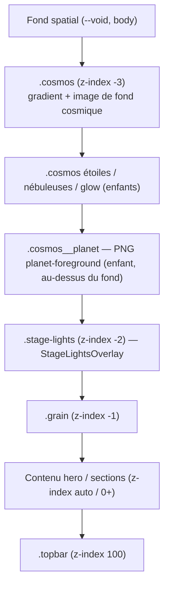

# Design Technique — stage-lights-overlay

## Overview

Ce document décrit l'implémentation technique du raffinement de l'effet décoratif
`StageLightsOverlay` sur la page d'accueil (`index.html`) de Planète HMI, ainsi que
le correctif de mise en page « fond cosmique derrière la planète » (Requirement 15).

Contraintes structurantes (rappel des requirements 10 et 12) :

- Stack **statique HTML/CSS/JS vanilla**, aucune dépendance, aucun framework,
  aucun build/lint/type-check/test (conforme au steering `tech.md`).
- **Aucun JavaScript** pour animer l'effet : tout repose sur des animations CSS
  (`transform` / `opacity`), des gradients et des pseudo-éléments.
- On **raffine l'overlay `.stage-lights` existant** (un seul overlay), on ne duplique rien.
- L'API conceptuelle (`intensity`, `showSmoke`, `variant`) est exposée via des
  attributs `data-*` sur le conteneur.

## Architecture

### Hiérarchie des calques (z-index)

Ordre d'empilement, du plus profond au plus proche de l'utilisateur :



| Couche | Sélecteur | z-index | position |
|---|---|---|---|
| Fond cosmique + planète | `.cosmos` (+ enfants) | `-3` | `fixed` |
| Projecteurs de scène | `.stage-lights` | `-2` | `fixed` |
| Grain | `.grain` | `-1` | `fixed` |
| Contenu | `main`, sections | auto / `0` | flux normal |
| En-tête | `.topbar` | `100` | `sticky` |

Le StageLightsOverlay est **au-dessus du fond cosmique et de la planète**, mais
**derrière tout le contenu et les éléments interactifs** (Requirement 9). Comme
`.cosmos` et `.stage-lights` sont `fixed` avec z-index négatif, ils restent derrière
le contenu en flux normal sans capter les clics.

### Correctif « fond derrière la planète » (Requirement 15)

État actuel à corriger : `.hero` possède un `background-image` (fond cosmique) + un
`::before` (hero-head) + un `::after` (scrim).

Design retenu :

1. **Retirer** `background-image` (+ `background-*`) de `.hero` et le `@media` mobile associé.
2. **Retirer** `.hero::before` (hero-head) et `.hero::after` (scrim) liés à ce fond.
3. Conserver l'image de fond cosmique **uniquement dans `.cosmos`**, peinte **sous**
   `.cosmos__planet` : le background est peint sur la boîte du parent, `.cosmos__planet`
   est un **enfant** donc empilé au-dessus → hiérarchie « fond < planète » garantie sans
   z-index supplémentaire.
4. Laisser `.cosmos__planet` en `z-index: auto` (jamais négatif).

## Components and Interfaces

### Structure HTML de l'overlay

Chaque projecteur est **un seul élément** exposant 3 rôles visuels (source, halo,
faisceau) via un `background` multi-gradient + `::before` (halo) + `::after` (faisceau),
ce qui limite le nombre de nœuds DOM (Requirement 10).

```html
<div class="stage-lights" aria-hidden="true"
     data-intensity="subtle" data-smoke="true" data-variant="hero">
  <span class="stage-lights__beam stage-lights__beam--tl"></span>
  <span class="stage-lights__beam stage-lights__beam--tr"></span>
  <span class="stage-lights__beam stage-lights__beam--bl"></span>
  <span class="stage-lights__beam stage-lights__beam--br"></span>
  <span class="stage-lights__smoke"></span>
</div>
```

### Composant CSS (source / halo / faisceau)

```css
.stage-lights__beam {
  position: absolute;
  width: clamp(160px, 26vw, 420px);
  height: 150vh;
  transform-origin: top center;      /* bottom center pour bl/br */
  opacity: var(--sl-beam-op);
  mix-blend-mode: screen;            /* additif : éclaircit sans masquer le texte */
  filter: blur(var(--sl-blur));
  will-change: transform, opacity;
  background: linear-gradient(180deg,
      color-mix(in srgb, var(--sl-blue) 60%, transparent), transparent 72%);
}
.stage-lights__beam::before {        /* halo */
  content: ""; position: absolute; width: 40%; aspect-ratio: 1; border-radius: 50%;
  filter: blur(30px); opacity: var(--sl-halo-op);
  background: radial-gradient(circle, var(--sl-cyan), transparent 62%);
}
```

Couleurs par coin (non saturées) : tl = or/blanc chaud, tr = bleu/cyan, bl = rouge
profond, br = magenta léger + blanc froid.

### Interface de configuration (API `data-*`)

| Attribut | Valeurs | Effet |
|---|---|---|
| `data-intensity` | `subtle` (défaut) / `medium` | surcharge des variables d'opacité (bornes respectées) |
| `data-smoke` | `true` (défaut) / `false` | affiche / masque `.stage-lights__smoke` |
| `data-variant` | `hero` (défaut) / `full-page` | calibrage de la couverture des faisceaux |

```css
[data-intensity="medium"] { --sl-beam-op: 0.22; --sl-halo-op: 0.30; --sl-smoke-op: 0.12; }
[data-smoke="false"] .stage-lights__smoke { display: none; }
```

### Équivalent React (documenté, NON implémenté — Requirement 12.3)

```tsx
// components/effects/StageLightsOverlay.tsx (future migration Next.js)
type Props = {
  className?: string;
  intensity?: "subtle" | "medium";   // -> data-intensity
  showSmoke?: boolean;                // -> data-smoke
  variant?: "hero" | "full-page";     // -> data-variant
};
// <div aria-hidden className={cn("stage-lights", className)}
//   data-intensity={intensity} data-smoke={String(showSmoke)} data-variant={variant} /> …
// Défauts accueil : intensity="subtle" showSmoke variant="hero".
```

## Data Models

Il n'y a pas de données persistées. Les seuls « modèles » sont les **tokens/variables
CSS** qui pilotent l'apparence, à ajouter dans `:root` :

```css
:root {
  --sl-blue:    #145BFF;  /* bleu électrique (identité) */
  --sl-cyan:    #46b7ff;  /* = --electric-2 */
  --sl-red:     #E52535;  /* rouge profond (identité) */
  --sl-magenta: #b0468f;  /* magenta très léger */
  --sl-white:   #f4efe4;  /* = --cream, blanc froid */

  --sl-beam-op:  0.14;    /* borne 0.08–0.22 */
  --sl-halo-op:  0.20;    /* borne 0.10–0.30 */
  --sl-smoke-op: 0.08;    /* borne 0.04–0.12 */
  --sl-blur:     22px;    /* filter: blur modéré */
}
```

Animations (durées désynchronisées 8–18 s, `ease-in-out`, `infinite`, rotation +
balayage + variation d'opacité) :

| Projecteur | Keyframe | Durée | transform-origin |
|---|---|---|---|
| tl | `sl-sweep-tl` | 9s | top center |
| tr | `sl-sweep-tr` | 13s | top center |
| bl | `sl-sweep-bl` | 16s | bottom center |
| br | `sl-sweep-br` | 11s | bottom center |
| fumée | `sl-drift` | 18s | — |

## Correctness Properties

Invariants qui doivent rester vrais après implémentation :

### Property 1: Opacités bornées
Faisceaux ∈ [0.08, 0.22], halos ∈ [0.10, 0.30], fumée ∈ [0.04, 0.12], y compris en `data-intensity="medium"`.
**Validates: Requirements 2.3, 2.4, 2.5, 11.5**

### Property 2: Zéro reflow
Seules `transform` et `opacity` sont animées ; aucune propriété déclenchant un recalcul de layout.
**Validates: Requirements 3.1, 10.4**

### Property 3: Non-interception
`.stage-lights` et tous ses descendants ont `pointer-events: none` ; tout élément interactif du hero reste cliquable.
**Validates: Requirements 5.3, 6.2**

### Property 4: Overlay unique
Exactement un `.stage-lights` dans le DOM de l'accueil.
**Validates: Requirements 1.4, 14.1**

### Property 5: Pas de scrollbar horizontale
Aucune barre de défilement horizontale à 320/375/390/430 px.
**Validates: Requirements 8.2**

### Property 6: Lisibilité préservée
Aucun élément lumineux opaque ne recouvre logo/titre/slogan/boutons (`mix-blend-mode: screen` + opacités faibles).
**Validates: Requirements 5.1, 5.2**

### Property 7: Portée limitée
`.stage-lights` absent de toutes les pages sauf `index.html`.
**Validates: Requirements 13.1, 13.2**

### Property 8: Accessibilité
`aria-hidden="true"` présent ; aucun descendant focusable.
**Validates: Requirements 6.1, 6.3**

## Error Handling

Le composant est purement décoratif : « gestion d'erreur » = dégradations gracieuses.

- **`prefers-reduced-motion: reduce`** : stopper toutes les animations, masquer la
  fumée, conserver un état statique subtil, sans clignotement.
- **`prefers-reduced-data: reduce`** : masquer la fumée (et halos coûteux si besoin).
- **Attributs `data-*` absents ou invalides** : les valeurs par défaut du `:root`
  et les sélecteurs par défaut s'appliquent (`subtle` / smoke visible / `hero`).
- **`color-mix`/`aspect-ratio` non supportés (navigateurs anciens)** : prévoir des
  couleurs de repli en `rgba()` explicites pour les faisceaux/halos afin d'éviter un
  faisceau invisible.
- **Mobile ≤ 560 px** : réduction à 2 projecteurs (`--bl`, `--br` masqués), flou et
  opacité réduits pour préserver les performances.

```css
.stage-lights, .stage-lights * { pointer-events: none; }
@media (prefers-reduced-motion: reduce) {
  .stage-lights__beam, .stage-lights__smoke,
  .stage-lights__beam::before, .stage-lights__beam::after { animation: none !important; }
  .stage-lights__smoke { display: none; }
  .stage-lights__beam { opacity: calc(var(--sl-beam-op) * 0.6); }
}
@media (prefers-reduced-data: reduce) { .stage-lights__smoke { display: none; } }
@media (max-width: 560px) {
  .stage-lights__beam--bl, .stage-lights__beam--br { display: none; }
  .stage-lights__beam { filter: blur(14px); }
}
```

## Testing Strategy

Aucun framework de test n'est configuré (site statique). Vérifications réalistes :

1. **Diagnostics** : `get_diagnostics` sur `index.html` et `assets/css/style.css` → 0 erreur bloquante.
2. **Inspection visuelle** (serveur `http://localhost:8080`) :
   - Desktop : 4 projecteurs visibles, faisceaux lents, fumée légère.
   - 320 / 375 / 390 / 430 px : pas de scrollbar horizontale, repli à 2 projecteurs.
   - `prefers-reduced-motion` (DevTools > Rendering) : animations stoppées, fumée off, pas de clignotement.
   - Clic des boutons hero (« Découvrir la planète », « Voir le classement ») : cliquables.
   - Texte du hero parfaitement lisible ; fond cosmique visible derrière la planète.
3. **Non-régression** : hero, couche cosmos et contenu inchangés hors overlay/fond.
4. **Portée** : confirmer l'absence de `.stage-lights` dans `artistes.html`,
   `classement.html`, `actualites.html`, `evenements.html`, `boutique.html`.

### Fichiers impactés

| Fichier | Modification |
|---|---|
| `index.html` | Attributs `data-intensity/data-smoke/data-variant` sur `.stage-lights` ; aucun ajout sur les autres pages |
| `assets/css/style.css` | Refonte section `.stage-lights` (variables `--sl-*`, source/halo/faisceau, 4 keyframes, fumée, `data-*`, responsive, reduced-motion/data) ; retrait `background-image`/`::before`/`::after` sur `.hero` ; vérif z-index de `.cosmos__planet` |

Aucune nouvelle dépendance, aucun nouveau fichier de code (le `.tsx` n'est documenté
qu'à titre indicatif).
