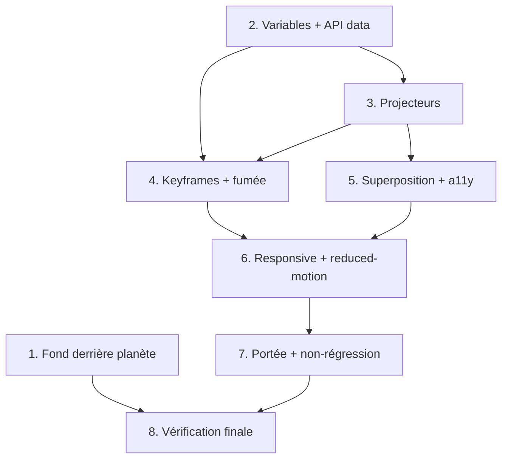

# Implementation Plan: stage-lights-overlay

## Overview

Raffinement de l'effet décoratif `StageLightsOverlay` sur la page d'accueil
(`index.html`) et correctif « fond cosmique derrière la planète ». Implémentation
100% HTML/CSS statique (aucun JS d'animation, aucune dépendance), en modifiant
`index.html` (attributs `data-*`) et `assets/css/style.css` (refonte `.stage-lights`,
ajustement `.hero`/`.cosmos`).

## Tasks

- [x] 1. Corriger le fond derrière la planète
  - Retirer `background-image` / `background-*` de `.hero` et son `@media` mobile associé
  - Retirer `.hero::before` (hero-head) et `.hero::after` (scrim) liés à ce fond
  - Vérifier que l'image de fond cosmique reste dans `.cosmos`, peinte sous `.cosmos__planet` (planet en `z-index: auto`)
  - _Requirements: 15.1, 15.2, 15.3_

- [x] 2. Ajouter les variables `--sl-*` et l'API `data-*`
  - Déclarer dans `:root` les couleurs (`--sl-blue`, `--sl-cyan`, `--sl-red`, `--sl-magenta`, `--sl-white`) et les opacités bornées (`--sl-beam-op`, `--sl-halo-op`, `--sl-smoke-op`, `--sl-blur`)
  - Ajouter `data-intensity="subtle" data-smoke="true" data-variant="hero"` sur `.stage-lights` dans `index.html`
  - Ajouter les sélecteurs `[data-intensity="medium"]` et `[data-smoke="false"]`
  - _Requirements: 2.1, 2.2, 11.1, 11.2, 11.3, 11.4, 11.5_

- [x] 3. Refondre les 4 projecteurs (source + halo + faisceau)
  - Réécrire `.stage-lights__beam` (faisceau via gradient, `mix-blend-mode: screen`, `transform-origin` par coin, `filter: blur` modéré, `clamp()` pour la largeur)
  - Ajouter `::before` (halo radial flou) et intégrer la source lumineuse discrète
  - Appliquer la répartition de couleurs par coin (tl or/blanc, tr bleu/cyan, bl rouge, br magenta/blanc) avec replis `rgba()`
  - Respecter les bornes d'opacité (faisceaux 0.08–0.22, halos 0.10–0.30)
  - _Requirements: 1.1, 1.2, 1.3, 1.4, 2.3, 2.4, 2.6, 10.1_

- [x] 4. Définir les 4 keyframes désynchronisées + fumée
  - Créer `sl-sweep-tl/tr/bl/br` (rotation douce + balayage + variation d'opacité, `transform`/`opacity` uniquement)
  - Durées distinctes 8–18 s, `ease-in-out`, `infinite`
  - Refondre `.stage-lights__smoke` (2–3 nappes radiales floues, opacité 0.04–0.12, animation `sl-drift` lente)
  - _Requirements: 3.1, 3.2, 3.3, 3.4, 3.5, 4.1, 4.2, 4.3, 10.3, 10.4_

- [x] 5. Superposition, accessibilité et non-interception
  - Confirmer z-index : `.cosmos` -3, `.stage-lights` -2, contenu au-dessus ; `.stage-lights` en `fixed`
  - `pointer-events: none` sur `.stage-lights` et descendants ; `aria-hidden="true"` sur le conteneur ; aucun focusable
  - _Requirements: 5.1, 5.2, 5.3, 6.1, 6.2, 6.3, 9.1, 9.2_

- [x] 6. Responsive + reduced-motion + reduced-data
  - `clamp()` sur tailles ; `@media (max-width: 560px)` masque `--bl`/`--br` (repli 2 projecteurs), réduit flou/opacité/largeur
  - Garantir aucune scrollbar horizontale (`overflow: hidden` sur l'overlay, `body { overflow-x: hidden }`)
  - `@media (prefers-reduced-motion: reduce)` : stopper animations, masquer fumée, état statique subtil sans clignotement
  - `@media (prefers-reduced-data: reduce)` : masquer fumée
  - _Requirements: 7.1, 7.2, 7.3, 7.4, 8.1, 8.2, 8.3, 10.2_

- [x] 7. Portée accueil uniquement (non-régression)
  - Vérifier que `.stage-lights` n'existe que dans `index.html` (absent de artistes/classement/actualites/evenements/boutique)
  - Vérifier que hero, cosmos et contenu restent intacts
  - _Requirements: 13.1, 13.2, 14.1, 14.2, 14.3_

- [x] 8. Vérification finale
  - `get_diagnostics` sur `index.html` et `assets/css/style.css` (0 erreur bloquante)
  - Contrôle serveur `http://localhost:8080` : 4 projecteurs desktop, faisceaux lents, fumée légère, texte lisible, boutons hero cliquables, fond derrière la planète
  - Contrôles 320/375/390/430 px : pas de scrollbar horizontale, repli à 2 projecteurs ; reduced-motion OK
  - _Requirements: 1.1, 5.3, 7.1, 8.2, 12.1, 12.2, 14.2, 14.3_

## Task Dependency Graph



```json
{
  "waves": [
    { "wave": 1, "tasks": ["1", "2"] },
    { "wave": 2, "tasks": ["3"] },
    { "wave": 3, "tasks": ["4", "5"] },
    { "wave": 4, "tasks": ["6"] },
    { "wave": 5, "tasks": ["7"] },
    { "wave": 6, "tasks": ["8"] }
  ]
}
```

## Notes

- Aucune nouvelle dépendance, aucun JS d'animation, un seul overlay `.stage-lights`.
- Pas de framework de test : vérification via `get_diagnostics` + inspection sur
  `http://localhost:8080` (serveur déjà lancé).
- Le composant React `StageLightsOverlay` reste documenté dans le design pour une
  future migration Next.js, sans être implémenté ici.
