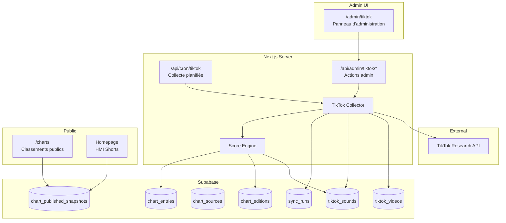
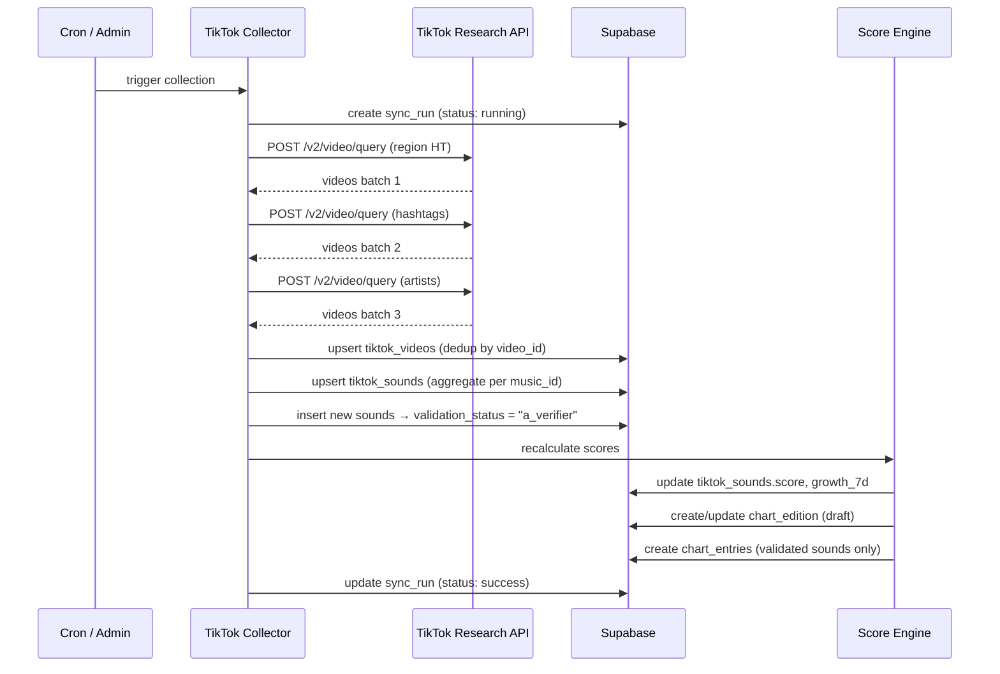

# Design Document — Module de Classement TikTok

## Overview

Le module TikTok Charts étend le système de classements multi-plateformes de Planète HMI pour intégrer les sons TikTok populaires en Haïti. Il suit le même patron architectural que le module Audiomack existant : collecte serveur → stockage brouillon → validation manuelle → publication contrôlée.

### Objectifs principaux

1. Collecter des vidéos TikTok liées à la musique haïtienne via l'API TikTok Research
2. Calculer un score composite par son musical (nombre de publications, vues, likes, partages, croissance 7j, diversité de créateurs)
3. Produire trois classements distincts : Global, En montée, Nouveautés
4. S'intégrer dans l'architecture existante (chart_sources, chart_editions, chart_entries, chart_published_snapshots)
5. Offrir un panneau d'administration dédié à `/admin/tiktok` avec validation manuelle obligatoire

### Décisions architecturales clés

| Décision | Justification |
|----------|---------------|
| Réutiliser `publishEdition`, `restoreLastPublished`, `cancelChanges` | Cohérence avec Audiomack, pas de duplication |
| Tables dédiées `tiktok_videos` + `tiktok_sounds` | Données brutes spécifiques à TikTok, séparées du modèle générique |
| Score calculé côté serveur (TypeScript) | Permet des coefficients configurables sans migration SQL |
| Cron API route + bouton admin | Double déclenchement : automatisé et manuel |
| Validation par son (pas par vidéo) | Un son = une entrée de classement, les vidéos sont des preuves |

---

## Architecture

### High-Level Architecture



### Low-Level Architecture — Module Layout

```
src/lib/tiktok/
├── api-client.ts          # Client HTTP TikTok Research API (auth, retry, rate limit)
├── collector.ts           # Orchestrateur de collecte (requêtes, dédup, persist)
├── score-engine.ts        # Calcul du score composite par son
├── chart-builder.ts       # Génération des 3 classements → chart_entries
├── sources.ts             # Définition des 3 chart_sources TikTok
├── schemas.ts             # Schémas Zod (validation entrées API)
├── types.ts               # Types TypeScript du module
└── constants.ts           # Hashtags, mots-clés, coefficients par défaut

src/app/admin/tiktok/
├── page.tsx               # Page serveur avec guard admin
├── TikTokManager.tsx      # Composant client — dashboard + onglets
├── ValidationQueue.tsx    # File de validation des sons
├── ChartEditor.tsx        # Éditeur d'entrées (réordonnement, masquage…)
└── HmiShortsSelector.tsx  # Sélection vidéos pour la homepage

src/app/api/admin/tiktok/
├── collect/route.ts       # POST — déclenche la collecte manuelle
├── validate/route.ts      # POST — valide/refuse un son
├── publish/route.ts       # POST — publie l'édition
├── restore/route.ts       # POST — restaure la dernière publication
├── cancel/route.ts        # POST — annule les changements
├── entries/route.ts       # PATCH — modifications d'entrées
└── shorts/route.ts        # POST/GET — gestion HMI Shorts

src/app/api/cron/tiktok/
└── route.ts               # POST — collecte planifiée (CRON_SECRET)
```

### Sequence Diagram — Collection Flow



---

## Components and Interfaces

### 1. TikTok API Client (`api-client.ts`)

```typescript
interface TikTokApiClientConfig {
  clientKey: string;
  clientSecret: string;
  baseUrl: string; // default: https://open.tiktokapis.com/v2
}

interface TikTokVideoQueryParams {
  region_code?: string;
  hashtag_names?: string[];
  keyword?: string;
  start_date: string; // YYYYMMDD
  end_date: string;   // YYYYMMDD
  max_count?: number; // max 100
  cursor?: number;
}

interface TikTokApiClient {
  authenticate(): Promise<string>; // returns access_token
  queryVideos(params: TikTokVideoQueryParams): Promise<TikTokVideoResponse>;
}
```

- Authentification OAuth2 client_credentials
- Exponential backoff sur rate limit (429) — max 3 retries
- Logging structuré de chaque requête

### 2. Collector (`collector.ts`)

```typescript
interface CollectionResult {
  ok: boolean;
  videosCollected: number;
  videosUpdated: number;
  newSounds: number;
  errors: string[];
  syncRunId: string;
}

interface TikTokCollector {
  runCollection(): Promise<CollectionResult>;
}
```

- Orchestre les 4 stratégies de requête (région, hashtags, keywords, artistes)
- Déduplique par `video_id` (upsert)
- Agrège les métriques par `music_id` dans `tiktok_sounds`
- Place les nouveaux sons en file de validation (`a_verifier`)
- Enregistre le run dans `sync_runs`

### 3. Score Engine (`score-engine.ts`)

```typescript
interface ScoreCoefficients {
  videoCount: number;      // poids du nombre de vidéos
  totalViews: number;      // poids des vues totales
  totalLikes: number;      // poids des likes
  totalComments: number;   // poids des commentaires
  totalShares: number;     // poids des partages
  growth7d: number;        // poids de la croissance 7j
  creatorDiversity: number; // poids de la diversité créateurs
}

interface ScoreEngineResult {
  soundsScored: number;
  editionId: string;
}

interface TikTokScoreEngine {
  recalculate(coefficients?: Partial<ScoreCoefficients>): Promise<ScoreEngineResult>;
  buildCharts(editionId: string): Promise<void>;
}
```

**Formule de score :**
```
score = (w1 × norm(video_count)) + (w2 × norm(total_views)) + (w3 × norm(total_likes))
      + (w4 × norm(total_comments)) + (w5 × norm(total_shares))
      + (w6 × norm(growth_7d)) + (w7 × norm(unique_creators))
```

Où `norm(x)` est une normalisation min-max sur l'ensemble des sons validés.

### 4. Chart Builder (`chart-builder.ts`)

```typescript
interface ChartBuilderConfig {
  sourceKeys: {
    global: string;       // "tiktok_haiti_global"
    enMontee: string;     // "tiktok_haiti_en_montee"
    nouveautes: string;   // "tiktok_haiti_nouveautes"
  };
  nouveautesWindowDays: number; // 14
}
```

- Filtre uniquement les sons avec `validation_status = "valide"`
- Trie par score composite (global), growth_7d (en montée), score + first_seen ≤ 14j (nouveautés)
- Crée des `chart_entries` avec `metric_value` = publications_count et `metric_unit` = "posts_count"

### 5. Admin Panel Components

| Composant | Rôle |
|-----------|------|
| `TikTokManager` | Dashboard principal, onglets Global/Montée/Nouveautés, résumé stats |
| `ValidationQueue` | Liste des sons `a_verifier`, boutons Valider/Refuser |
| `ChartEditor` | Édition des entrées (réordonnement, masquage, exclusion, override titre/artiste/artwork) |
| `HmiShortsSelector` | Sélection de vidéos pour la section homepage (max 10) |

---

## Data Models

### Table `tiktok_videos`

| Colonne | Type | Contraintes |
|---------|------|-------------|
| id | uuid | PK, default gen_random_uuid() |
| video_id | text | UNIQUE, NOT NULL |
| music_id | text | NOT NULL, FK → tiktok_sounds.music_id |
| username | text | NOT NULL |
| create_time | timestamptz | NOT NULL |
| region_code | text | |
| view_count | bigint | default 0 |
| like_count | bigint | default 0 |
| comment_count | bigint | default 0 |
| share_count | bigint | default 0 |
| hashtag_names | text[] | default '{}' |
| video_description | text | |
| collected_at | timestamptz | default now() |
| updated_at | timestamptz | default now() |

**RLS :** public read → deny ; service_role → full access.

### Table `tiktok_sounds`

| Colonne | Type | Contraintes |
|---------|------|-------------|
| id | uuid | PK, default gen_random_uuid() |
| music_id | text | UNIQUE, NOT NULL |
| sound_title | text | NOT NULL |
| sound_author | text | |
| total_videos | integer | default 0 |
| total_views | bigint | default 0 |
| total_likes | bigint | default 0 |
| total_comments | bigint | default 0 |
| total_shares | bigint | default 0 |
| unique_creators | integer | default 0 |
| score | numeric(12,4) | default 0 |
| growth_7d | numeric(8,4) | default 0 (pourcentage) |
| previous_total_videos | integer | nullable (snapshot 7j) |
| previous_snapshot_at | timestamptz | nullable |
| validation_status | text | default 'a_verifier', CHECK IN ('a_verifier','valide','refuse') |
| first_seen_at | timestamptz | default now() |
| last_updated_at | timestamptz | default now() |
| artist_id | uuid | nullable, FK → artists.id |

**RLS :** public read → deny ; service_role → full access.

### Table `tiktok_featured_shorts`

| Colonne | Type | Contraintes |
|---------|------|-------------|
| id | uuid | PK |
| video_id | text | NOT NULL, FK → tiktok_videos.video_id |
| music_id | text | NOT NULL, FK → tiktok_sounds.music_id |
| display_order | integer | NOT NULL |
| selected_at | timestamptz | default now() |
| selected_by | uuid | FK → auth.users.id |

**Contrainte :** max 10 entrées actives, `validation_status` du son associé doit être "valide".

### Intégration `chart_sources` (données seed)

```sql
INSERT INTO chart_sources (source_key, platform, display_name, chart_context, market_code, ingestion_mode, metric_unit, is_active)
VALUES
  ('tiktok_haiti_global', 'tiktok', 'Top TikTok Haiti - Global', 'Sons populaires en Haïti — Score global', 'HT', 'OFFICIAL_API', 'posts_count', true),
  ('tiktok_haiti_en_montee', 'tiktok', 'Top TikTok Haiti - En montée', 'Sons populaires en Haïti — Croissance 7 jours', 'HT', 'OFFICIAL_API', 'posts_count', true),
  ('tiktok_haiti_nouveautes', 'tiktok', 'Top TikTok Haiti - Nouveautés', 'Sons populaires en Haïti — Découvertes récentes (14 jours)', 'HT', 'OFFICIAL_API', 'posts_count', true);
```

### Intégration `chart_editions` / `chart_entries`

Le module TikTok réutilise les tables existantes :
- `chart_editions` : une édition par source par cycle de collecte, statut `draft` → `ready` (après publication)
- `chart_entries` : une entrée par son validé, `source_position` = rang score, `metric_value` = total_videos (publications count)
- `platform_tracks` : entrée avec `platform = "tiktok"`, `external_id` = music_id

### Enregistrement `sync_runs`

Chaque collecte insère une ligne dans `sync_runs` existant :
```sql
INSERT INTO sync_runs (platform, source_key, status, records_received, records_normalized, started_at, completed_at, error_details)
VALUES ('tiktok', 'tiktok_haiti_global', 'success', 342, 342, ..., ..., NULL);
```

---


## Correctness Properties

*A property is a characteristic or behavior that should hold true across all valid executions of a system — essentially, a formal statement about what the system should do. Properties serve as the bridge between human-readable specifications and machine-verifiable correctness guarantees.*

### Property 1: Video normalization completeness

*For any* valid TikTok API video response, normalizing it through the collector SHALL produce an object containing all required fields: video_id, music_id, username, create_time, region_code, view_count, like_count, comment_count, share_count, hashtag_names, and video_description.

**Validates: Requirements 2.5**

### Property 2: Deduplication idempotence

*For any* TikTok video with a given video_id, collecting it N times (N ≥ 1) SHALL result in exactly one record in tiktok_videos, with metrics reflecting the most recent collection values.

**Validates: Requirements 2.6**

### Property 3: Score computation respects weighted formula

*For any* valid set of sound metrics and *for any* valid coefficient configuration, the composite score SHALL equal the weighted sum of normalized components. Increasing any single metric (with others fixed) SHALL not decrease the resulting score.

**Validates: Requirements 3.1, 3.2**

### Property 4: 7-day growth formula correctness

*For any* sound with a current total_videos count `C` and a previous-week count `P` (where P > 0), the computed growth_7d SHALL equal `((C - P) / P) * 100`. When P = 0 and C > 0, growth SHALL be a defined maximum value.

**Validates: Requirements 3.3**

### Property 5: Creator diversity equals distinct username count

*For any* set of videos sharing the same music_id, the computed unique_creators value SHALL equal the count of distinct usernames in that set.

**Validates: Requirements 3.4**

### Property 6: New sounds default to validation queue

*For any* video collected with a music_id not previously present in tiktok_sounds, the system SHALL create a tiktok_sounds entry with validation_status = "a_verifier".

**Validates: Requirements 4.1, 8.3**

### Property 7: Only validated sounds appear in charts

*For any* chart edition (Global, En montée, or Nouveautés), every chart_entry SHALL reference a sound whose validation_status is "valide". No sound with status "a_verifier" or "refuse" SHALL appear in any chart output.

**Validates: Requirements 4.3, 4.4, 4.5**

### Property 8: Global chart sorted by composite score descending

*For any* set of validated sounds with computed scores, the "tiktok_haiti_global" chart entries SHALL be ordered such that for consecutive entries at positions i and i+1, score(i) ≥ score(i+1).

**Validates: Requirements 5.2**

### Property 9: En montée chart sorted by 7-day growth descending

*For any* set of validated sounds with computed growth_7d values, the "tiktok_haiti_en_montee" chart entries SHALL be ordered such that for consecutive entries at positions i and i+1, growth_7d(i) ≥ growth_7d(i+1).

**Validates: Requirements 5.3**

### Property 10: Nouveautés filter and sort

*For any* set of validated sounds, the "tiktok_haiti_nouveautes" chart SHALL include only sounds where first_seen_at is within the previous 14 days, and those included sounds SHALL be sorted by composite score in descending order.

**Validates: Requirements 5.4**

### Property 11: Chart entries metric_value equals publications count

*For any* chart_entry in a TikTok chart edition, the metric_value SHALL equal the total_videos count of the referenced sound, and metric_unit SHALL be "posts_count".

**Validates: Requirements 6.3**

### Property 12: HMI Shorts constraints

*For any* state of the tiktok_featured_shorts table, (a) the number of active entries SHALL not exceed 10, and (b) every featured video SHALL be associated with a sound whose validation_status is "valide".

**Validates: Requirements 10.3, 10.4**

---

## Error Handling

### API Authentication Errors

| Situation | Comportement |
|-----------|-------------|
| Credentials manquantes (env vars) | Exception au démarrage du collector, sync_run non créé |
| Token expiré / invalide | Log erreur, halt sans persister de données partielles |
| Réponse 401/403 | Log descriptif + sync_run status "error" |

### Rate Limiting (429)

- Retry avec exponential backoff : délais de 1s, 4s, 16s (base 4)
- Maximum 3 tentatives par requête
- Si échec après 3 retries : marquer la requête comme échouée, continuer avec les données partielles récoltées
- Si toutes les requêtes échouent : sync_run status "error", aucune donnée écrasée

### Collection Failures

| Situation | Comportement |
|-----------|-------------|
| Erreur réseau mid-collection | Les vidéos déjà insérées restent (upsert atomique par batch), sync_run "partial_error" |
| 0 vidéos récupérées | sync_run "error", aucune modification des éditions |
| Score engine crash | sync_run "error", tiktok_videos/sounds restent à jour mais chart_entries non régénérées |

### Validation Edge Cases

| Situation | Comportement |
|-----------|-------------|
| Son sans titre (music_id inconnu) | Stocké avec sound_title = "Son inconnu — {music_id}" |
| Video sans music_id | Ignorée (non stockée dans tiktok_videos) |
| Validation status change attempt on non-existent sound | Retour erreur 404 |

### Admin Panel Errors

- Toutes les actions admin (publish, restore, cancel) propagent les erreurs de `publishEdition` / `restoreLastPublished` / `cancelChanges` avec un message French-friendly
- Perte de session : redirection vers `/admin/login`
- Requête non-admin : retour 403 via `requireAdmin`

---

## Testing Strategy

### Property-Based Tests (vitest + fast-check)

Le projet utilise déjà **vitest**. Le module ajoutera **fast-check** comme dépendance dev pour les property-based tests.

Configuration : minimum **100 itérations** par test de propriété.

Chaque test sera taggé avec le format :
`Feature: tiktok-charts-module, Property {number}: {property_text}`

**Tests de propriété à implémenter :**

| # | Property | Cible |
|---|----------|-------|
| 1 | Video normalization completeness | `src/lib/tiktok/schemas.ts` |
| 2 | Deduplication idempotence | `src/lib/tiktok/collector.ts` |
| 3 | Score weighted formula | `src/lib/tiktok/score-engine.ts` |
| 4 | 7-day growth formula | `src/lib/tiktok/score-engine.ts` |
| 5 | Creator diversity | `src/lib/tiktok/score-engine.ts` |
| 6 | New sounds default status | `src/lib/tiktok/collector.ts` |
| 7 | Only validated sounds in charts | `src/lib/tiktok/chart-builder.ts` |
| 8 | Global chart sorting | `src/lib/tiktok/chart-builder.ts` |
| 9 | En montée chart sorting | `src/lib/tiktok/chart-builder.ts` |
| 10 | Nouveautés filter + sort | `src/lib/tiktok/chart-builder.ts` |
| 11 | Metric value = publications | `src/lib/tiktok/chart-builder.ts` |
| 12 | HMI Shorts constraints | `src/lib/tiktok/chart-builder.ts` |

### Unit Tests (vitest)

- Schéma Zod validation : entrées valides/invalides
- API client : mock responses (success, 401, 429, 500)
- Score engine : cas limites (0 vidéos, division par zéro growth)
- Retry logic : vérification du nombre de tentatives et délais

### Integration Tests

- Collecte end-to-end avec API TikTok mockée → vérifier tiktok_videos, tiktok_sounds, sync_runs
- Workflow draft → publish → restore → cancel avec Supabase local
- Cron route : CRON_SECRET validation, response format

### Smoke Tests

- Chart sources seed : vérifier les 3 clés existent
- RLS policies : vérifier que public ne peut pas écrire dans tiktok_videos/tiktok_sounds
- Admin guard : vérifier que `/admin/tiktok` nécessite authentification
- Module "server-only" : vérifier l'import dans les fichiers serveur

### Test File Structure

```
src/lib/tiktok/__tests__/
├── score-engine.property.test.ts    # Properties 3, 4, 5
├── chart-builder.property.test.ts   # Properties 7, 8, 9, 10, 11, 12
├── collector.property.test.ts       # Properties 1, 2, 6
├── api-client.test.ts               # Unit tests (retry, auth)
├── schemas.test.ts                  # Unit tests (validation)
└── integration.test.ts              # Integration tests (full flow)
```
